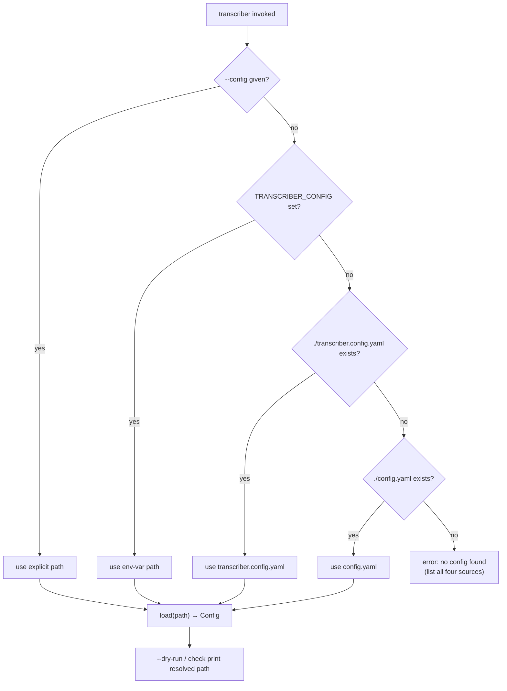

# Spec: Convert the transcriber into a fully installable tool

Derived from `docs/seed/installable-tool.md` and the brainstorm `docs/brainstorms/INSTALLABLE_TOOL.md`.

## Problem Statement

Each host repo currently consumes the engine as a **git submodule** at `./transcriber`, wires it via `[tool.uv.sources] transcriber = { path = "transcriber" }`, carries a hand-maintained `transcribe.py` wrapper (whose only real job is injecting that host's `--config` default), and depends on `transcriber[agno]`. Deploying an engine change is a brittle three-step ritual per host: push the engine, `git pull` the submodule, then **mandatorily** `uv sync --reinstall-package transcriber` (the host runs the *installed* package in `.venv`, not the submodule source, so a submodule checkout alone does not take effect).

Convert `transcriber` into a tool a host simply **installs from the git repo and runs**, eliminating the submodule, the per-host wrapper, and the `--reinstall-package` ritual. The engine is already installable in principle (it has a `[project.scripts] transcriber = "transcriber.__main__:main"` entry point and a hatchling wheel build); this work changes the **adoption model and config-resolution entry point**, not the pipeline.

The recommended **Approach A** (git-ref host dependency with `uv run transcriber`) was selected over Approach B (`uv tool install`) and Approach C (index/PyPI), which are deferred as incremental, non-destructive future steps.

## Requirements

R1. The engine resolves its config path in strict precedence: (1) an explicit `--config PATH`; (2) the `TRANSCRIBER_CONFIG` environment variable (when set and non-empty); (3) the first existing of `transcriber.config.yaml`, then `config.yaml` in the current working directory; (4) otherwise exit non-zero with a clear error naming all four sources. **Strict-source failure (E3/E5):** when `--config` is given, or `TRANSCRIBER_CONFIG` is set and non-empty, the referenced path is **authoritative** — it must be an existing *regular file* (`.is_file()`), and if it is missing or not a regular file the resolver fails immediately with a clear error and **never falls back** to CWD candidates. An empty or whitespace-only `TRANSCRIBER_CONFIG` is treated as **unset** (proceed to CWD candidates).
R2. The config resolution applies identically to the default command and the `check` subcommand, **regardless of flag/subcommand ordering** (`transcriber --config X check` and `transcriber check --config X` behave identically). The `check` subparser must not clobber an explicitly-provided root `--config` (see P5: use `argparse.SUPPRESS` as the subparser `--config` default).
R3. The resolved config path is surfaced in `--dry-run` plan output and `check` output, **and logged at `INFO` level in `main()` at the start of every normal batch run** (E8) — e.g. `logger.info("using config: %s", config_path)` — so unattended runs record which config was loaded. The path only (never config contents or secrets) is emitted.
R4. When `--config` is given explicitly, behaviour is unchanged from today except for the strict-file validation in R1 (no auto-discovery, no env-var consultation).
R5. `agno` becomes a **core, non-optional dependency**: `agno[mcp]~=3.0` and `openai~=1.0` move from `[project.optional-dependencies].agno` into `[project.dependencies]`, so a bare `transcriber` install can run `summarize`. To decouple the engine release from host `pyproject.toml` edits (P3/X1), a **deprecated no-op extra `agno = []`** is retained under `[project.optional-dependencies]` (with an explanatory comment) so an existing host dependency string `transcriber[agno]` keeps resolving during the migration window; it may be dropped in a later release once all hosts drop `[agno]`.
R5b. CWD-candidate shadowing (P6): when **both** `transcriber.config.yaml` and `config.yaml` exist in the CWD and neither `--config` nor `TRANSCRIBER_CONFIG` is used, the resolver selects `transcriber.config.yaml` and emits a visible `INFO`/`WARNING` noting the other file was shadowed.
R6. The engine builds and `uv lock`s cleanly after the dependency change; the full test suite passes (`uv run pytest -q`).
R7. The README adoption model changes from "git submodule" to "git-ref dependency": a host declares `transcriber` (not `transcriber[agno]`) and points `[tool.uv.sources]` at `{ git = "ssh://git@github.com/scartill/transcriber.git", branch = "enhanced-pipeline" }`, invoking via `uv run transcriber`. The `transcribe.py` wrapper is documented as removed. Config auto-discovery precedence and `TRANSCRIBER_CONFIG` are documented. A manual tag-release step is documented, **and the docs show the immutable `tag = "vX.Y.Z"` ref form (P2) alongside the branch form, plus the HTTPS personal-access-token remote syntax (P4) for non-interactive/CI environments that lack an SSH agent.**
R8. **(External integration runbook — not an engine PR acceptance criterion; P1.)** Engine completion is defined solely by R1–R7, R9, R10. The per-host migration (repoint `[tool.uv.sources]` to the git ref, remove the `./transcriber` submodule and its `.gitmodules` entry, delete `transcribe.py`, drop `[agno]` from the dependency string, `uv lock --upgrade-package transcriber && uv sync`, and verify `uv run transcriber --dry-run` + `uv run transcriber check`) is documented in the runbook (Task 5) and executed separately per the deploy factoid against the three hosts (scartill-ai-hub, adsight/ai-hub, flyvercity/local-transcribe). The engine PR cannot alter or verify external repositories.
R9. No new distribution infrastructure is introduced (no index, no bucket, no PyPI). The repo stays private; installs are git-ref over the existing SSH remote.
R10. No behavioural change to the transcription pipeline, backends, publishing, or config schema beyond the config-resolution entry point and the dependency promotion.

## Background (source audit)

- **Entry point:** `transcriber/__main__.py:main(argv)` calls `config = load(args.config)`. `args.config` is populated by `_build_parser()`, which sets `--config default=DEFAULT_CONFIG` where `DEFAULT_CONFIG = "config.yaml"` (module constant), on **both** the root parser and the `check` subparser. There is no CWD search and no env-var consultation today.
- **Dry-run / check output:** `main()` branches to `print_plan(config, recordings)` for `--dry-run` and `_cmd_check(config)` for `check`. Neither currently prints the config path; both are the natural place to surface the resolved path (R3).
- **Config loader:** `transcriber/config.py:load(path)` dispatches on file suffix (`.json`/`.yaml`/`.yml`) into the validated `Config` dataclass. It is unaffected by this change — only *which path* is handed to it changes. `SUMMARY_BACKENDS = ("agno",)` is already the only summarize backend, which is why R5 (agno→core) is low-risk.
- **Packaging:** `pyproject.toml` has `dependencies = ["duct", "scenedetect", "av", "PyYAML", "httpx"]`, `[project.optional-dependencies].agno = ["agno[mcp]~=3.0", "openai~=1.0"]`, `[project.scripts] transcriber = "transcriber.__main__:main"`, hatchling build with `packages = ["transcriber"]`.
- **Host wiring (verified, scartill-ai-hub):** host `pyproject.toml` has `dependencies = ["transcriber[agno]"]` and `[tool.uv.sources] transcriber = { path = "transcriber" }`. The two host wrapper variants: scartill/adsight inject a `transcriber.config.yaml` default (handling the `check` arg ordering); flyvercity forwards `sys.argv` verbatim relying on the engine's `config.yaml` default. Both wrapper behaviours are subsumed by R1's auto-discovery (`transcriber.config.yaml` then `config.yaml`).
- **Deploy factoid:** hosts run the installed package in `.venv\Lib\site-packages`; today a submodule checkout requires `uv sync --reinstall-package transcriber`. With a git-ref source, `uv lock --upgrade-package transcriber && uv sync` picks up a new branch commit — a plain `uv sync`, no `--reinstall-package`.

## Proposed Solution

Two engine-side changes (config auto-discovery + agno→core) plus docs; the host migration is executed separately per host as a mechanical repoint.



### Config resolution design (`transcriber/__main__.py` + `transcriber/config.py`)

Introduce a pure resolver and stop baking a static default into the parser. Place the new exception in `config.py` alongside `ConfigError`/`MissingEnvVarError` (E1), and widen `load` to accept `str | Path` (E2):

```python
# transcriber/config.py
class ConfigNotFoundError(ConfigError, FileNotFoundError):
    """No config path could be resolved from CLI, env, or CWD conventions."""

def load(path: str | Path) -> Config:   # was: path: str
    ...

# transcriber/__main__.py
from transcriber.config import ConfigNotFoundError, load

CONFIG_ENV_VAR = "TRANSCRIBER_CONFIG"
CONFIG_CANDIDATES = ("transcriber.config.yaml", "config.yaml")

def resolve_config_path(
    cli_config: Optional[str],
    env: Mapping[str, str],
    cwd: Path,
) -> Path:
    # 1) explicit --config  -> authoritative: must .is_file(), else raise (no fallback)
    # 2) TRANSCRIBER_CONFIG  -> if set and .strip(): authoritative, must .is_file(), else raise
    #                           empty/whitespace -> treated as unset
    # 3) CWD candidates in order; if BOTH exist, log that config.yaml is shadowed
    # 4) none -> ConfigNotFoundError naming all four sources
    ...
```

- `_build_parser()` sets the **root** `--config` default to `None`, and the **`check` subparser** `--config` default to `argparse.SUPPRESS` (P5/X2) so an omitted subparser flag never overwrites a root-level `--config` (fixes the `transcriber --config X check` clobber). `DEFAULT_CONFIG` is retired.
- `main()` calls `resolve_config_path(args.config, os.environ, Path.cwd())`, then `logger.info("using config: %s", config_path)` (E8/X3), then `load(config_path)`; a `ConfigNotFoundError` (and the strict missing-file errors) map to the existing non-zero config-error exit path (exit 2) with an actionable message.
- `print_plan(...)` and `_cmd_check(...)` gain a line echoing the resolved config path (R3). Path only, never secrets.
- Strict-file validation uses `Path.is_file()` so a directory passed via `--config .`/`TRANSCRIBER_CONFIG=./config` fails with a clear `ConfigNotFoundError`/`ConfigError`, not a raw `IsADirectoryError` (E5).

### Packaging change (`pyproject.toml`)

```toml
[project]
dependencies = [
    "duct", "scenedetect", "av", "PyYAML", "httpx",
    "agno[mcp]~=3.0", "openai~=1.0",   # promoted from the former [agno] extra
]

[project.optional-dependencies]
# Deprecated no-op: agno is now a core dependency (above). This empty extra is
# retained so existing host dependency strings `transcriber[agno]` keep
# resolving during the migration window; drop it once all hosts drop [agno].
agno = []
```

### Host migration shape (per host, R8 — documented, run via the deploy factoid)

```toml
# host pyproject.toml
dependencies = ["transcriber"]            # was transcriber[agno] (the no-op extra keeps that resolving too)
[tool.uv.sources]
# branch form (active development):
transcriber = { git = "ssh://git@github.com/scartill/transcriber.git", branch = "enhanced-pipeline" }
# immutable tag form (preferred once stabilised, P2):
# transcriber = { git = "ssh://git@github.com/scartill/transcriber.git", tag = "v0.2.0" }
# HTTPS + token form for non-interactive/CI runners without an SSH agent (P4):
# transcriber = { git = "https://<token>@github.com/scartill/transcriber.git", tag = "v0.2.0" }
```
Then: `git submodule deinit -f transcriber && git rm -f transcriber`, edit `.gitmodules`, delete `transcribe.py`, `uv lock --upgrade-package transcriber && uv sync`, verify.

## Task Breakdown

### Task 1 — Config auto-discovery resolver (`transcriber/__main__.py` + `transcriber/config.py`)
- **Objective:** Implement `resolve_config_path(cli_config, env, cwd)` with R1 precedence; define `ConfigNotFoundError(ConfigError, FileNotFoundError)` in `config.py` (E1) and widen `load` to `str | Path` (E2); set the root `--config` default to `None` and the **`check` subparser `--config` default to `argparse.SUPPRESS`** (P5); wire `main()` to resolve → `logger.info("using config: %s", path)` (E8) → `load(...)`; map the not-found and strict-missing-file cases to the existing exit-2 config-error path with a message naming all four sources (`--config`, `TRANSCRIBER_CONFIG`, `transcriber.config.yaml`, `config.yaml`).
- **Guidance:** Keep the resolver a **pure function** of its arguments (inject `env` and `cwd`) so it is unit-testable without touching the real environment or filesystem CWD; use `tmp_path` + explicit `env` dicts. Enforce strict-source semantics: `--config` and a non-empty `TRANSCRIBER_CONFIG` are authoritative — validate with `Path.is_file()` and raise immediately on a missing/non-file path **without** CWD fallback (E3/E5); treat empty/whitespace `TRANSCRIBER_CONFIG` as unset. When both CWD candidates exist, select `transcriber.config.yaml` and log the shadow (P6/R5b). Preserve exit code 2 for config errors.
- **Tests (E7 — full matrix):**
  - explicit `--config` wins even when env/CWD candidates exist (R4);
  - **argument ordering:** `transcriber --config X check` **and** `transcriber check --config X` both resolve `X` (P5 regression test — the pre-fix `None`/clobber bug must fail this);
  - `TRANSCRIBER_CONFIG` used when no `--config`; `TRANSCRIBER_CONFIG=""`/whitespace treated as unset → CWD candidates;
  - **non-existent `--config` path → exit 2, no CWD fallback;** **non-existent `TRANSCRIBER_CONFIG` path → exit 2, no CWD fallback;**
  - directory passed to `--config`/`TRANSCRIBER_CONFIG` → clear error, not raw `IsADirectoryError` (E5);
  - `transcriber.config.yaml` preferred over `config.yaml` when both exist **and a shadow log is emitted** (P6); `config.yaml` used when only it exists;
  - none present → `ConfigNotFoundError` → exit 2 with all four sources named;
  - precedence + ordering identical for the `check` subcommand (R2);
  - `main()` emits the `using config:` INFO line on a normal run (E8).
- **Demo:** in a `tmp` dir with only `config.yaml`, `uv run transcriber --dry-run` resolves it; with both files, `transcriber.config.yaml` wins (shadow logged); `TRANSCRIBER_CONFIG=other.yaml uv run transcriber --dry-run` uses it; `TRANSCRIBER_CONFIG=missing.yaml uv run transcriber --dry-run` fails without falling back.

### Task 2 — Surface resolved config path in `--dry-run` and `check` (`transcriber/__main__.py`)
- **Objective:** `print_plan(...)` and `_cmd_check(...)` each emit the resolved config path (R3). Pass the resolved `Path` through to both.
- **Guidance:** Print the path only (never config contents or secrets). Add one line near the top of each output block; keep the existing backend-visibility lines intact.
- **Tests:** capture stdout — `--dry-run` output contains the resolved path; `check` (pass and fail paths) contains the resolved path; existing plan/backend assertions still hold.
- **Demo:** `uv run transcriber --config examples/acme.config.yaml --dry-run` shows the path; `uv run transcriber --config examples/acme.config.yaml check` shows it too.

### Task 3 — Promote `agno` to a core dependency (`pyproject.toml`)
- **Objective:** Move `agno[mcp]~=3.0` + `openai~=1.0` into `[project.dependencies]`; **retain a deprecated no-op `agno = []` extra** under `[project.optional-dependencies]` with an explanatory comment (R5/P3/X1) so `transcriber[agno]` keeps resolving during migration. Re-`uv lock`.
- **Guidance:** Keep the `dev` extra/group untouched. Confirm no code references the `agno` extra name for behaviour; the summarize path already treats `agno` as the sole backend. Verify a bare `uv sync` (no extras) now installs `agno` + `openai`, **and that `uv sync --extra agno` still succeeds (no-op)**.
- **Tests:** full suite green (`uv run pytest -q`) (R6); `uv lock --check` resolves cleanly and the lock is validated on Python 3.10+ (E9); importing the summarize backend works after a no-extras install; a test asserting the packaged prompt templates are present and readable (e.g. `transcriber/prompt_templates/*.md` resolve via the agent's template dir) so a wheel/git-ref build cannot silently drop them (E6). Confirm `tests/test_examples.py` and any packaging/metadata tests still pass.
- **Demo:** `uv sync` (no `--extra agno`) then `uv run python -c "import transcriber.backends.summarize_agno"` succeeds; `uv sync --extra agno` succeeds as a no-op; `uv lock --check` is clean.

### Task 4 — README + release docs
- **Objective:** Rewrite the "Adopting as a git submodule" section to the git-ref dependency model (R7): host declares `transcriber` (not `transcriber[agno]`, though the no-op extra keeps that resolving), points `[tool.uv.sources]` at the git ref (show both the `branch` form and the immutable `tag` form, plus the HTTPS+token form for CI), runs `uv run transcriber`; `transcribe.py` removed; document config auto-discovery precedence + `TRANSCRIBER_CONFIG` (including the strict-source and shadowing rules) and that relative config paths resolve against CWD; update prerequisites (no submodule step; `agno` now always installed, drop the `uv sync --extra agno` instruction); document the manual tag-release step (`bump version → git tag vX.Y.Z → push`).
- **Guidance:** Follow the Markdown house rule — no hard-wrapping; one logical line per paragraph. Keep the migration note consistent with prior README migration notes in tone. Do not use absolute paths in the doc.
- **Tests:** n/a (docs) — proofread for internal consistency with the new config precedence and dependency string.
- **Demo:** README adoption section reads end-to-end with the new install + run flow.

### Task 5 — Host migration runbook (documentation only, R8)
- **Objective:** Capture the exact per-host migration steps (repoint `[tool.uv.sources]`, remove submodule + `.gitmodules` entry, delete `transcribe.py`, drop `[agno]`, `uv lock --upgrade-package transcriber && uv sync`, verify `--dry-run` + `check`) as a runbook in the spec/README so each of the three hosts can be migrated consistently. **The actual host edits are executed separately via the deploy factoid, not in the engine repo.**
- **Guidance:** PowerShell per project convention (`pwsh -NoProfile -NoLogo`); note the inline-paren/`[[` parser caveat (use a temp script / `git commit -F`). Note the no-`--reinstall-package` improvement. **Include a post-migration verification step (P7): from each host root run `uv run transcriber check` (pre-flight binaries + env + resolved config) and `uv run transcriber --dry-run` (confirms the right config is auto-discovered and the publishing plan is intact).**
- **Tests:** n/a.
- **Demo:** runbook present and self-contained.

## Risks

- **Config auto-discovery changes default behaviour** — a host relying on the old static `config.yaml` default or the wrapper's `transcriber.config.yaml` injection could resolve a different file. Mitigation: deterministic precedence that preserves both prior conventions, the full E7 per-branch unit matrix, the shadow log (P6), and the resolved path surfaced in `--dry-run`/`check` (Task 2) and logged on every run (E8).
- **CWD-relative config paths break when invoked externally (E4)** — `recordings_dir: ./recordings` resolves against `Path.cwd()`, so running `transcriber` from the wrong directory silently finds zero recordings and exits 0. Mitigation: document that relative config paths resolve against CWD and that `transcriber` must be run from the host root; the `using config:` INFO line (E8) aids diagnosis.
- **`agno` in core bloats every install** (pulls MCP + `openai`) — intended per the user override; mitigation: `uv lock --check` resolves cleanly on Python 3.10+ (E9) and the no-op `agno = []` extra (P3) decouples the engine release from host `pyproject.toml` edits.
- **Branch-ref drift** — hosts synced at different times run different engine code, and `uv lock --upgrade-package` pulls whatever is on branch HEAD (P2); accepted during active `enhanced-pipeline` dev. Mitigation: each host's `uv.lock` records the resolved commit; cut an immutable tag (`v0.2.0`) and move hosts to the `tag =` ref form once stable.
- **Submodule removal is messy in git** — standard `deinit` → `.gitmodules` edit → `git rm --cached` sequence, reversible via re-add; run per host only after engine changes land.
- **SSH auth unavailable in a non-interactive/CI context (P4)** breaks git-ref installs — hosts are developer machines with SSH agents today; the adoption docs include the HTTPS+token ref form for CI/Docker runners.
- **Packaging data files (E6, corrected)** — `uv` **does** build and install a wheel even from a git-ref source, and `hatchling` already ships all package data under `packages = ["transcriber"]`, so `prompt_templates/*.md` are included today. Task 3 adds an explicit test asserting the packaged templates are present/readable so a future refactor cannot silently drop them. (The earlier claim that "wheels are not built for Approach A" was incorrect and has been removed.)
