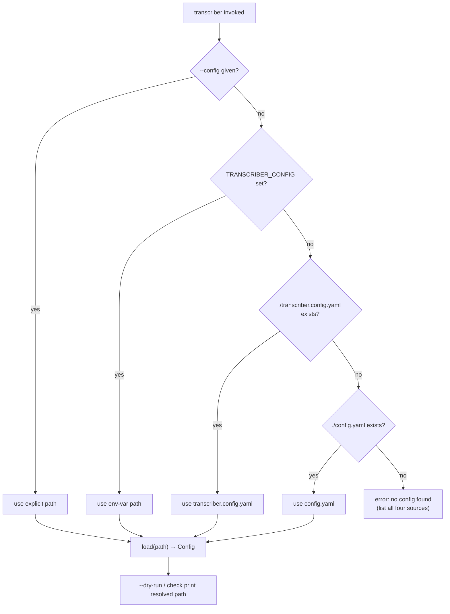

# Spec: Convert the transcriber into a fully installable tool

Derived from `docs/seed/installable-tool.md` and the brainstorm `docs/brainstorms/INSTALLABLE_TOOL.md`.

## Problem Statement

Each host repo currently consumes the engine as a **git submodule** at `./transcriber`, wires it via `[tool.uv.sources] transcriber = { path = "transcriber" }`, carries a hand-maintained `transcribe.py` wrapper (whose only real job is injecting that host's `--config` default), and depends on `transcriber[agno]`. Deploying an engine change is a brittle three-step ritual per host: push the engine, `git pull` the submodule, then **mandatorily** `uv sync --reinstall-package transcriber` (the host runs the *installed* package in `.venv`, not the submodule source, so a submodule checkout alone does not take effect).

Convert `transcriber` into a tool a host simply **installs from the git repo and runs**, eliminating the submodule, the per-host wrapper, and the `--reinstall-package` ritual. The engine is already installable in principle (it has a `[project.scripts] transcriber = "transcriber.__main__:main"` entry point and a hatchling wheel build); this work changes the **adoption model and config-resolution entry point**, not the pipeline.

The recommended **Approach A** (git-ref host dependency with `uv run transcriber`) was selected over Approach B (`uv tool install`) and Approach C (index/PyPI), which are deferred as incremental, non-destructive future steps.

## Requirements

R1. The engine resolves its config path from, in strict precedence: (1) an explicit `--config PATH`; (2) the `TRANSCRIBER_CONFIG` environment variable; (3) the first existing of `transcriber.config.yaml`, then `config.yaml` in the current working directory; (4) otherwise exit non-zero with a clear error naming all four sources.
R2. The config resolution applies identically to the default command and the `check` subcommand.
R3. The resolved config path is surfaced in both `--dry-run` plan output and `check` output.
R4. When `--config` is given explicitly, behaviour is unchanged from today (no auto-discovery, no env-var consultation).
R5. `agno` becomes a **core, non-optional dependency**: `agno[mcp]~=3.0` and `openai~=1.0` move from `[project.optional-dependencies].agno` into `[project.dependencies]`, and the `[agno]` extra is removed. A bare `transcriber` install can run `summarize`.
R6. The engine builds and `uv lock`s cleanly after the dependency change; the full test suite passes (`uv run pytest -q`).
R7. The README adoption model changes from "git submodule" to "git-ref dependency": a host declares `transcriber` (not `transcriber[agno]`) and points `[tool.uv.sources]` at `{ git = "ssh://git@github.com/scartill/transcriber.git", branch = "enhanced-pipeline" }`, invoking via `uv run transcriber`. The `transcribe.py` wrapper is documented as removed. Config auto-discovery precedence and `TRANSCRIBER_CONFIG` are documented. A manual tag-release step is documented.
R8. Each of the three hosts (scartill-ai-hub, adsight/ai-hub, flyvercity/local-transcribe) migrates off the submodule: repoint `[tool.uv.sources]` to the git+branch ref, remove the `./transcriber` submodule and its `.gitmodules` entry, delete `transcribe.py`, drop `[agno]` from the dependency string, re-lock and sync, and verify `uv run transcriber --dry-run` resolves the right config and `uv run transcriber check` passes. **(Host-side; executed per the deploy factoid, not part of the engine PR.)**
R9. No new distribution infrastructure is introduced (no index, no bucket, no PyPI). The repo stays private; installs are git-ref over the existing SSH remote.
R10. No behavioural change to the transcription pipeline, backends, publishing, or config schema beyond the config-resolution entry point and the dependency promotion.

## Background (source audit)

- **Entry point:** `transcriber/__main__.py:main(argv)` calls `config = load(args.config)`. `args.config` is populated by `_build_parser()`, which sets `--config default=DEFAULT_CONFIG` where `DEFAULT_CONFIG = "config.yaml"` (module constant), on **both** the root parser and the `check` subparser. There is no CWD search and no env-var consultation today.
- **Dry-run / check output:** `main()` branches to `print_plan(config, recordings)` for `--dry-run` and `_cmd_check(config)` for `check`. Neither currently prints the config path; both are the natural place to surface the resolved path (R3).
- **Config loader:** `transcriber/config.py:load(path)` dispatches on file suffix (`.json`/`.yaml`/`.yml`) into the validated `Config` dataclass. It is unaffected by this change — only *which path* is handed to it changes. `SUMMARY_BACKENDS = ("agno",)` is already the only summarize backend, which is why R5 (agno→core) is low-risk.
- **Packaging:** `pyproject.toml` has `dependencies = ["duct", "scenedetect", "av", "PyYAML", "httpx"]`, `[project.optional-dependencies].agno = ["agno[mcp]~=3.0", "openai~=1.0"]`, `[project.scripts] transcriber = "transcriber.__main__:main"`, hatchling build with `packages = ["transcriber"]`.
- **Host wiring (verified, scartill-ai-hub):** host `pyproject.toml` has `dependencies = ["transcriber[agno]"]` and `[tool.uv.sources] transcriber = { path = "transcriber" }`. The two host wrapper variants: scartill/adsight inject a `transcriber.config.yaml` default (handling the `check` arg ordering); flyvercity forwards `sys.argv` verbatim relying on the engine's `config.yaml` default. Both wrapper behaviours are subsumed by R1's auto-discovery (`transcriber.config.yaml` then `config.yaml`).
- **Deploy factoid:** hosts run the installed package in `.venv\Lib\site-packages`; today a submodule checkout requires `uv sync --reinstall-package transcriber`. With a git-ref source, `uv lock --upgrade-package transcriber && uv sync` picks up a new branch commit — a plain `uv sync`, no `--reinstall-package`.

## Proposed Solution

Two engine-side changes (config auto-discovery + agno→core) plus docs; the host migration is executed separately per host as a mechanical repoint.



### Config resolution design (`transcriber/__main__.py`)

Introduce a pure resolver and stop baking a static default into the parser:

```python
CONFIG_ENV_VAR = "TRANSCRIBER_CONFIG"
CONFIG_CANDIDATES = ("transcriber.config.yaml", "config.yaml")

class ConfigNotFoundError(FileNotFoundError):
    """No config path could be resolved from CLI, env, or CWD conventions."""

def resolve_config_path(
    cli_config: Optional[str],
    env: Mapping[str, str],
    cwd: Path,
) -> Path:
    # 1) explicit --config  2) TRANSCRIBER_CONFIG  3) CWD candidates  4) error
    ...
```

- `_build_parser()` changes `--config` default from `DEFAULT_CONFIG` to `None` (both root and `check`) so "unset" is distinguishable from an explicit value. `DEFAULT_CONFIG` is retired or kept only as documentation.
- `main()` calls `resolve_config_path(args.config, os.environ, Path.cwd())` and passes the result to `load(...)`; a `ConfigNotFoundError` maps to the existing non-zero config-error exit path (exit 2) with the four-source message.
- `print_plan(...)` and `_cmd_check(...)` gain a line echoing the resolved config path (R3). Keep the path, never secrets.

### Packaging change (`pyproject.toml`)

```toml
[project]
dependencies = [
    "duct", "scenedetect", "av", "PyYAML", "httpx",
    "agno[mcp]~=3.0", "openai~=1.0",
]
# [project.optional-dependencies].agno removed entirely.
```

### Host migration shape (per host, R8 — documented, run via the deploy factoid)

```toml
# host pyproject.toml
dependencies = ["transcriber"]            # was transcriber[agno]
[tool.uv.sources]
transcriber = { git = "ssh://git@github.com/scartill/transcriber.git", branch = "enhanced-pipeline" }
```
Then: `git submodule deinit -f transcriber && git rm -f transcriber`, edit `.gitmodules`, delete `transcribe.py`, `uv lock --upgrade-package transcriber && uv sync`, verify.

## Task Breakdown

### Task 1 — Config auto-discovery resolver (`transcriber/__main__.py`)
- **Objective:** Implement `resolve_config_path(cli_config, env, cwd)` with R1 precedence and a `ConfigNotFoundError`; change `--config` default to `None` on both the root parser and the `check` subparser; wire `main()` to resolve then `load(...)`; map the not-found case to the existing exit-2 config-error path with a message naming all four sources (`--config`, `TRANSCRIBER_CONFIG`, `transcriber.config.yaml`, `config.yaml`).
- **Guidance:** Keep the resolver a **pure function** of its arguments (inject `env` and `cwd`) so it is unit-testable without touching the real environment or filesystem CWD; use `tmp_path` + explicit `env` dicts in tests. Preserve the existing exit codes (2 for config errors). Do not change `config.load`.
- **Tests:** explicit `--config` wins even when env/CWD candidates exist (R4); `TRANSCRIBER_CONFIG` used when no `--config`; `transcriber.config.yaml` preferred over `config.yaml` when both exist; `config.yaml` used when only it exists; none present → `ConfigNotFoundError` → exit 2 with all four sources named; precedence identical for the `check` subcommand (R2).
- **Demo:** in a `tmp` dir with only `config.yaml`, `uv run transcriber --dry-run` resolves it; with both files, `transcriber.config.yaml` wins; `TRANSCRIBER_CONFIG=other.yaml uv run transcriber --dry-run` uses it.

### Task 2 — Surface resolved config path in `--dry-run` and `check` (`transcriber/__main__.py`)
- **Objective:** `print_plan(...)` and `_cmd_check(...)` each emit the resolved config path (R3). Pass the resolved `Path` through to both.
- **Guidance:** Print the path only (never config contents or secrets). Add one line near the top of each output block; keep the existing backend-visibility lines intact.
- **Tests:** capture stdout — `--dry-run` output contains the resolved path; `check` (pass and fail paths) contains the resolved path; existing plan/backend assertions still hold.
- **Demo:** `uv run transcriber --config examples/acme.config.yaml --dry-run` shows the path; `uv run transcriber --config examples/acme.config.yaml check` shows it too.

### Task 3 — Promote `agno` to a core dependency (`pyproject.toml`)
- **Objective:** Move `agno[mcp]~=3.0` + `openai~=1.0` into `[project.dependencies]`; remove `[project.optional-dependencies].agno` (R5). Re-`uv lock`.
- **Guidance:** Keep the `dev` extra/group untouched. Confirm no code or test references the `agno` extra name; the summarize path already treats `agno` as the sole backend. Verify a bare `uv sync` (no extras) now installs `agno` + `openai`.
- **Tests:** full suite green (`uv run pytest -q`) (R6); a check (test or documented command) that importing the summarize backend works after a no-extras install. Confirm `tests/test_examples.py` and any packaging/metadata tests still pass.
- **Demo:** `uv sync` (no `--extra agno`) then `uv run python -c "import transcriber.backends.summarize_agno"` succeeds.

### Task 4 — README + release docs
- **Objective:** Rewrite the "Adopting as a git submodule" section to the git-ref dependency model (R7): host declares `transcriber` (not `transcriber[agno]`), points `[tool.uv.sources]` at the git+branch ref, runs `uv run transcriber`; `transcribe.py` removed; document config auto-discovery precedence + `TRANSCRIBER_CONFIG`; update prerequisites (no submodule step; `agno` now always installed, drop the `uv sync --extra agno` instruction); document the manual tag-release step (`bump version → git tag vX.Y.Z → push`) for the future tagged-pin phase.
- **Guidance:** Follow the Markdown house rule — no hard-wrapping; one logical line per paragraph. Keep the migration note consistent with prior README migration notes in tone. Do not use absolute paths in the doc.
- **Tests:** n/a (docs) — proofread for internal consistency with the new config precedence and dependency string.
- **Demo:** README adoption section reads end-to-end with the new install + run flow.

### Task 5 — Host migration runbook (documentation only, R8)
- **Objective:** Capture the exact per-host migration steps (repoint `[tool.uv.sources]`, remove submodule + `.gitmodules` entry, delete `transcribe.py`, drop `[agno]`, `uv lock --upgrade-package transcriber && uv sync`, verify `--dry-run` + `check`) as a runbook in the spec/README so each of the three hosts can be migrated consistently. **The actual host edits are executed separately via the deploy factoid, not in the engine repo.**
- **Guidance:** PowerShell per project convention (`pwsh -NoProfile -NoLogo`); note the inline-paren/`[[` parser caveat (use a temp script / `git commit -F`). Note the no-`--reinstall-package` improvement.
- **Tests:** n/a.
- **Demo:** runbook present and self-contained.

## Risks

- **Config auto-discovery changes default behaviour** — a host relying on the old static `config.yaml` default or the wrapper's `transcriber.config.yaml` injection could resolve a different file. Mitigation: deterministic precedence that preserves both prior conventions, full per-branch unit coverage, and the resolved path surfaced in `--dry-run`/`check` (Task 2).
- **`agno` in core bloats every install** (pulls MCP + `openai`) — intended per the user override; mitigation: confirm `uv lock` resolves on all three hosts and no host relied on an agno-less install.
- **Branch-ref drift** — hosts synced at different times run different engine code (accepted during active `enhanced-pipeline` dev); mitigation: each host's `uv.lock` records the resolved commit; move to tagged refs once stable.
- **Submodule removal is messy in git** — standard `deinit` → `.gitmodules` edit → `git rm --cached` sequence, reversible via re-add; run per host only after engine changes land on `enhanced-pipeline`.
- **SSH auth unavailable in a future CI** breaks git-ref installs — hosts are developer machines with SSH agents today; document an HTTPS+token fallback if CI is added.
- **Deferred packaging gap** — if Approach B/C (wheel/`uv tool`/index) is adopted later, the wheel must ship `transcriber/prompt_templates/*.md`; add a packaging test at that point (not needed for Approach A, which builds from source).
