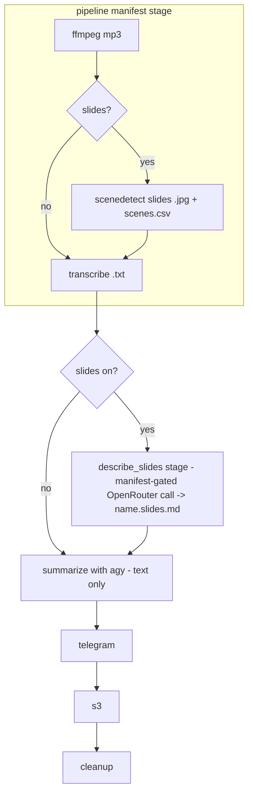

# Spec: Offload Slide Description to a Cheap OpenRouter Vision Model

## Problem Statement

Slide description is currently performed inside the heavy `agy` agent run. The
agent receives the extracted slide image paths, opens each image (vision), and
writes the "Slide Descriptions" section as part of the same run that summarizes
the transcript and publishes to Notion. Vision work on the heavy agent is the
expensive part of the run.

We want to move slide description out of `agy` into a dedicated stage that calls
a cheaper, configurable **OpenRouter** vision model. After this change, `agy`
becomes a **text-only** summarizer + publisher: it consumes a pre-generated
slide-descriptions markdown file as text and no longer performs any vision work.

## Motivation, Baseline & Success

- **Baseline (to record during implementation).** The ROI premise is that vision
  is the dominant cost of a slides-on `agy` run. Before wiring the new stage,
  capture a rough baseline for one representative slides-on recording: approx.
  wall time and (if surfaced by the bridge) token/cost of the current combined
  run. After the change, compare against the OpenRouter call's logged
  slide-count/elapsed time (R13) plus the now-cheaper `agy` text run. This need
  not be precise — one line in the implementation notes is enough to confirm the
  win is real.
- **Why a dedicated stage instead of just cheapening `agy`'s model.** Simply
  pointing `agy` at a cheaper vision model was considered and rejected: `agy`'s
  model is not configurable per-stage from this engine, a cheaper *general* agent
  would also degrade summary/Notion quality, and decoupling lets the vision step
  and the summary/publish step scale, retry, and be priced independently.
- **Success criteria.** Cost/latency of a slides-on run drops materially with no
  visible quality regression in the "Slide Descriptions" section on a sample
  recording (manual parity check, Task 6).
- **Rollback.** The change is self-contained: revert the `describe_slides` stage
  and restore image-path threading in `agent.py`/`__main__.py`. No data migration
  is involved, so rollback is cheap.

## Requirements

- **R1.** When `stages.slides` is enabled, slide description is produced by a
  dedicated pipeline stage that calls OpenRouter's image-understanding
  (chat-completions) API with a cheap, configurable model.
- **R2.** The stage writes a `<name>.slides.md` intermediate artifact. The
  summarize stage (`agy`) then consumes that markdown **as text** and no longer
  receives image paths or performs vision.
- **R3.** Secrets follow the existing pattern: the config stores the OpenRouter
  API-key **environment-variable name** only; the value is resolved at *use*
  time via `resolve_env`. No secrets are stored in config.
- **R4.** When `stages.slides` is disabled, behavior is unchanged: no slide
  stage runs and no slide block appears in the summary prompt.
- **R5.** Failure isolation: a *transport/format* OpenRouter failure fails the
  slides stage for that recording (retryable via the state manifest). It does
  **not** silently fall back to the expensive `agy` vision path. A **valid empty
  description** (the model correctly finds no slide worth describing) is **not**
  a failure — see R10.
- **R6.** The existing `slide_extractor.md` rules are reused as the vision
  prompt so output format and quality are preserved. Because the extractor
  requires per-slide `**Timestamp:** MM:SS - MM:SS` lines, the payload **must**
  carry per-slide scene timing: for each slide image, its start/end timestamp
  (parsed from `<name>.scenes.csv`) is included as a small text part immediately
  before that image's `image_url` part, so the model can emit accurate
  timestamps. If timing metadata is unavailable for an image, its timestamp is
  passed as unknown rather than omitted.
- **R7.** Cleanup deletes `<name>.slides.md`; `--keep-intermediates` preserves
  it. The `<name>.slides.md` intermediate must never be confused with the
  durable `<name>.md` summary.
- **R8.** The OpenRouter model, base URL, and API-key env-var name are
  configurable. The model defaults to a cheap vision model
  (`google/gemini-2.0-flash-001`); the base URL defaults to
  `https://openrouter.ai/api/v1`. A per-stage `timeouts.slides` key is added
  (default 900s).
- **R9.** Pre-flight validation: when `stages.slides` is enabled, the config
  must include an `openrouter` section, and the referenced API-key env var is
  checked in the pre-flight check.
- **R10.** Empty-result semantics: an empty image set (no `.jpg` produced) and a
  valid empty model description both resolve to an **empty `<name>.slides.md`**
  (zero-length or whitespace-only). The `describe_slides` stage still completes
  successfully and is marked done in the manifest. The summarize stage treats an
  empty `<name>.slides.md` exactly like slides-off: it omits the slide block. A
  `SlideDescribeError` is raised **only** for transport/format failures
  (non-2xx, malformed JSON, missing `choices[0].message.content`), never for an
  intentionally empty description.
- **R11.** Transient-failure resilience: `describe_slides` retries `429` and
  `5xx` responses with bounded exponential backoff (small, capped attempt count)
  before raising `SlideDescribeError`.
- **R12.** Privacy / data egress: enabling slides sends slide imagery **and**
  transcript text to a third party (OpenRouter). This new outbound trust
  boundary is documented in the spec and the README schema section so operators
  with sensitive content make an informed choice. The API key, `Authorization`
  header, and base64 image bytes are never written to logs or error messages.
- **R13.** Observability: each `describe_slides` call logs (at INFO) the model
  id, slide count, and elapsed wall time — never payload contents (R12). This
  also supplies the cost/latency baseline the motivation rests on.

## Background (Codebase Internals)

- **`transcriber/agent.py`**
  - `_slide_block(slide_image_paths)` reads `prompt_templates/slide_extractor.md`
    and renders a "Slide descriptions" instruction block listing the image
    paths. Returns `""` when there are no slides (so the prompt has no slide
    instructions at all).
  - `build_prompt(config, transcript_path, slide_image_paths, *, output_file,
    digest_file, inline_transcript)` threads the slide block into
    `prompt_templates/summary.md`'s `{slide_block}` placeholder. Transcript is
    wrapped in a non-XML Markdown code fence (`_transcript_fence`) with a
    fence-length guard (`_fence_for`).
  - `run_agent(config, transcript_path, recording_dir, slide_image_paths)`
    resolves the output path, builds the prompt with `inline_transcript=False`
    (agy reads the transcript file by absolute path — the full transcript would
    overflow the Windows command line), exposes the host workspace via
    `add_dirs`, and drives `agy` through `agy_headless_bridge.run`.
- **`transcriber/pipeline.py`**
  - `process_recording` runs, in order: ffmpeg (mp4→mp3), scenedetect (optional,
    slides), transcribe (mp3→`.txt` via `elevenlabs ... --format text`). Each
    stage is idempotent (skips when its output already exists). `_run_command`
    is the single child-process seam (monkeypatched in tests).
  - `RecordingResult.new_artifacts` currently tracks a subset of
    `{"mp3", "slides", "txt"}`.
- **`transcriber/__main__.py`**
  - `_slide_image_paths(mp4, config)` returns the sorted `.jpg` files under
    `extracted_slides.<name>/` when slides are enabled, else `[]`.
  - `_transcript_path(mp4, config)` returns `<name>.txt`.
  - `_process_one` drives stages using the state manifest: `pipeline` →
    `summarize`(+`notion`) → `telegram` → `s3` → `cleanup`. The summarize step
    calls `run_agent(config, _transcript_path(...), mp4.parent,
    _slide_image_paths(...))`.
  - `_enabled_stage_names` builds the dry-run plan. `preflight_check` verifies
    required binaries and env vars; `_required_env_vars` currently returns the
    Telegram token env-var name.
- **`transcriber/state.py`** — ordered stage manifest
  `STAGES = (pipeline, summarize, notion, telegram, s3, cleanup)`; only listed
  stages are tracked; `mark_complete` persists immediately.
- **`transcriber/cleanup.py`** — `INTERMEDIATE_SUFFIXES = (".mp3", ".txt",
  ".scenes.csv")`; `intermediate_paths` also lists `<name>.telegram.md` and the
  `extracted_slides.<name>/` dir; `KEEP_SUFFIXES = (".mp4", ".md")`;
  `_has_keep_suffix` special-cases `.telegram.md` so the digest is deletable.
- **`transcriber/config.py`** — dataclass model with `_build_section` helper;
  optional sections (`s3`) are built present-or-`None`; `Timeouts` fields each
  default to `DEFAULT_TIMEOUT_SECONDS` (900). `resolve_env(name)` resolves a
  secret at use time and raises `MissingEnvVarError` when absent.
- **Dependencies** — `httpx` is already a declared dependency of `transcriber`;
  no new dependency is required.
- **OpenRouter image understanding** — OpenAI-compatible endpoint
  `POST {base_url}/chat/completions`. Request: `{"model": ..., "messages":
  [{"role": "user", "content": [ {"type": "text", "text": ...},
  {"type": "image_url", "image_url": {"url": "data:image/jpeg;base64,<b64>"}} ]}]}`
  with header `Authorization: Bearer <key>`. Response text is at
  `choices[0].message.content`. Slide images are JPEGs
  (`extracted_slides.<name>/*.jpg`).

## Proposed Solution

Insert a new **manifest-gated orchestrator stage**, `describe_slides`, that runs
after the deterministic `pipeline` stage and before `summarize`, only when
`stages.slides` is enabled. The paid OpenRouter call lives in this orchestrator
step (in `__main__._process_one`), guarded by `state.is_complete("describe_slides")`,
so the state manifest actually protects the paid call on retry. The `pipeline`
stage stays limited to ffmpeg + scenedetect + transcribe and does **not** make
the network call (single owner — resolves the two-owner hazard).

The `describe_slides` step base64-encodes each extracted slide `.jpg`, pairs each
with its scene timestamp (parsed from `<name>.scenes.csv`), sends them together
with the `slide_extractor.md` rules and the transcript (as text context) to the
configured OpenRouter model in a single chat-completions call, and writes the
returned markdown to `<name>.slides.md`. The write is idempotent (skip if the
file already exists) and the manifest gate prevents re-issuing the paid call.

`agent.py` is changed so that, when a non-empty `<name>.slides.md` exists, the
summary prompt **embeds that markdown text** (fenced, non-XML) with an
instruction to incorporate it as the "Slide Descriptions" section — `agy`
receives no image paths and does no vision. An empty `<name>.slides.md` is
treated exactly like slides-off (block omitted). A new optional `openrouter`
config section holds the API-key env-var name, model, and base URL, plus a
`timeouts.slides` key.



### Config model additions

```python
@dataclass
class OpenRouter:
    api_key_env: str
    model: str = "google/gemini-2.0-flash-001"
    base_url: str = "https://openrouter.ai/api/v1"

@dataclass
class Timeouts:
    ffmpeg: int = DEFAULT_TIMEOUT_SECONDS
    scenedetect: int = DEFAULT_TIMEOUT_SECONDS
    slides: int = DEFAULT_TIMEOUT_SECONDS       # NEW
    elevenlabs: int = DEFAULT_TIMEOUT_SECONDS
    agy: int = DEFAULT_TIMEOUT_SECONDS
    s3: int = DEFAULT_TIMEOUT_SECONDS

# Config gains: openrouter: Optional[OpenRouter] = None
# Validation: if stages.slides and openrouter is None -> ConfigError
```

### Config shape (YAML)

```yaml
stages:
  slides: true
  s3_sync: false
openrouter:
  api_key_env: OPENROUTER_API_KEY      # env-var NAME, resolved at use time
  model: google/gemini-2.0-flash-001   # cheap vision model (default)
  base_url: https://openrouter.ai/api/v1
timeouts:
  slides: 600
```

### New module: `transcriber/slides_describe.py`

```python
class SlideDescribeError(RuntimeError): ...

def describe_slides(
    slides: Sequence[SlideInput],   # (image_path, start_ts, end_ts) per slide
    transcript_text: str,
    config: Config,
    *,
    timeout: float,
) -> str:
    """Return slide-description markdown from a single OpenRouter vision call.

    Empty slide list -> returns "" without an HTTP call (valid empty result).
    A valid empty model response -> returns "" (NOT an error).
    Raises SlideDescribeError only on transport/format failure (non-2xx after
    bounded 429/5xx retries, malformed JSON, or missing message content).
    """
```

Behavior:
- Resolve the key via `resolve_env(config.openrouter.api_key_env)`.
- Read `prompt_templates/slide_extractor.md`; build one user message: a leading
  text part (extractor rules + language instruction + transcript context),
  then, per slide in deterministic order, a small text part naming its
  `Timestamp: MM:SS - MM:SS` (from `<name>.scenes.csv`; `unknown` when missing)
  followed by that slide's `image_url` part (`data:image/jpeg;base64,...`).
- **Downscale** each JPEG to a bounded max dimension (e.g. long edge ≤ 1024 px)
  before base64 to cap tokens/cost; scenedetect frames are full-resolution video
  frames, so this materially reduces payload size. State the max dimension as a
  module constant.
- Send headers `Authorization: Bearer <key>`, plus `HTTP-Referer` and `X-Title`
  (OpenRouter attribution — some models/rankings expect them; harmless
  otherwise). Never log these headers or the body.
- POST to `{base_url}/chat/completions` via `httpx` honoring `timeout`; retry
  `429`/`5xx` with bounded exponential backoff (R11); return
  `choices[0].message.content` (empty/whitespace → `""`, a valid empty result).

The single HTTP call keeps cost and latency bounded and gives the model all
slides + transcript at once for cross-slide dedup/context (matching the
extractor rules). **Payload ceiling:** a very long meeting can produce many
slides; downscaling plus JPEG keeps per-image size small, but implementers
should note the target model's context/request-size limits. If the encoded
payload is implausibly large, that is an accepted `SlideDescribeError`
(transport failure) rather than a silently truncated request; document the
expected practical max (tens of slides).

## Task Breakdown

### Task 1 — Config: `openrouter` section + `timeouts.slides` + validation

**Objective.** Extend `transcriber/config.py` with an optional `OpenRouter`
dataclass (`api_key_env`, `model` default `google/gemini-2.0-flash-001`,
`base_url` default `https://openrouter.ai/api/v1`), built present-or-`None` like
`s3`. Add `slides: int = DEFAULT_TIMEOUT_SECONDS` to `Timeouts` (place it after
`scenedetect`). Add validation: when `stages.slides` is true and `openrouter` is
`None`, raise `ConfigError` with a clear message (mirrors the S3
"required-only-when-enabled" rule).

**Implementation guidance.** Follow the `S3` optional-section pattern in
`_from_dict` (`data.get("openrouter")` → `_build_section` or `None`). Perform
the slides/openrouter cross-field check next to the existing
`summary.language` validation.

**Test requirements** (`tests/test_config.py`, extend `BASE_CONFIG`):
- JSON/YAML parity produces identical models with `openrouter` present.
- `openrouter` omitted with `stages.slides: false` → `cfg.openrouter is None`.
- `stages.slides: true` without `openrouter` → `ConfigError` mentioning
  `openrouter`.
- `openrouter` with only `api_key_env` uses default `model` and `base_url`.
- `timeouts.slides` defaults to 900 and is overridable; existing timeout tests
  still pass.

**Demo.** `load()` a slides-on config with `openrouter` and assert
`cfg.openrouter.model` and `cfg.timeouts.slides`; show a slides-on config
without `openrouter` raising a clear `ConfigError`.

### Task 2 — OpenRouter vision client (`slides_describe.py`)

**Objective.** New module exposing `describe_slides(slides, transcript_text,
config, *, timeout) -> str` and `SlideDescribeError`, where each `slides` entry
carries an image path plus optional `(start_ts, end_ts)`.

**Implementation guidance.** Sort slides deterministically (by scene/index).
Downscale each `.jpg` to a bounded long-edge max (module constant, e.g. 1024 px)
then base64-encode into a `data:image/jpeg;base64,...` URL. Build the
OpenAI-compatible chat-completions payload: leading text part (extractor rules +
language instruction + transcript context), then per slide a small text part
naming `Timestamp: MM:SS - MM:SS` (from the passed timing; `unknown` when
missing) immediately followed by that slide's `image_url` part. Resolve the key
with `resolve_env(config.openrouter.api_key_env)`; send `Authorization: Bearer
<key>`, `HTTP-Referer`, and `X-Title`. Use `httpx` with the given `timeout`.
Retry `429`/`5xx` with bounded exponential backoff (small capped attempts) then
raise `SlideDescribeError`. On non-2xx (after retries), malformed JSON, or
missing `choices[0].message.content` → raise `SlideDescribeError`. Empty slide
list → return `""` with **no** HTTP call. A valid empty/whitespace model
response → return `""` (NOT an error). Keep the module free of
pipeline/orchestration concerns. **Log hygiene:** `SlideDescribeError` messages
and any logging must include only status + a short body snippet — never the
`Authorization` header, `HTTP-Referer`/`X-Title`, or base64 image bytes.

**Test requirements** (`tests/test_slides_describe.py`, mock `httpx`):
- Request shape: correct URL (`{base_url}/chat/completions`), `Authorization`
  header present, `model` from config, exactly one `image_url` part per slide,
  each URL starting with `data:image/jpeg;base64,`, and a `Timestamp:` text part
  preceding each image.
- 200 response → returns `choices[0].message.content`.
- Valid empty/whitespace content → returns `""` (no exception).
- 4xx (non-429) / malformed JSON → `SlideDescribeError`.
- **Retry:** `429` then `200` → succeeds after backoff (patch sleep); repeated
  `5xx` → `SlideDescribeError` after the capped attempts.
- Empty slide list → returns `""` and makes **no** HTTP call.
- Missing API-key env var → `MissingEnvVarError` (from `resolve_env`).
- **Log hygiene:** on error, the raised message contains neither the key/header
  values nor base64 bytes.

**Demo.** With a mocked `httpx` transport, run over two fixture images (with fake
timestamps) and print the returned markdown; simulate a 429→200 and a persistent
500 to show retry then failure.

### Task 3 — Slide-input assembly helper (scene timing); pipeline stays network-free

**Objective.** Provide the inputs the `describe_slides` call needs, **without**
making the paid call inside `pipeline.process_recording`. The `pipeline` stage
remains ffmpeg + scenedetect + transcribe only (single-owner rule, E1). Add a
helper that gathers the ordered slide images and their scene timestamps.

**Implementation guidance.** Add a helper (in `slides_describe.py` or a small
`slides_index.py`) `build_slide_inputs(recording_dir, name) -> list[SlideInput]`
that lists `extracted_slides.<name>/*.jpg` in deterministic order and joins each
to its `(start_ts, end_ts)` by parsing `<name>.scenes.csv` (scenedetect's
`list-scenes -f` output). Missing/unparseable timing → `unknown`. Do **not**
add the OpenRouter call to `process_recording`; `RecordingResult` is unchanged
by this task (the `<name>.slides.md` artifact is produced by the orchestrator
step in Task 5). Zero `.jpg` files → returns `[]` (drives the empty-result path,
R10).

**Test requirements** (`tests/test_slides_describe.py` or `tests/test_pipeline.py`):
- `build_slide_inputs` returns images in stable order with timestamps joined
  from a fixture `scenes.csv`.
- Missing `scenes.csv` or unmatched image → timing `unknown`, no exception.
- Zero images → `[]`.
- `pipeline.process_recording` makes **no** network/`describe_slides` call
  (existing pipeline tests still pass unchanged).

**Demo.** Run `build_slide_inputs` on a fixture slides dir + `scenes.csv` and
print the ordered `(path, start, end)` tuples.

### Task 4 — Agent: embed slide markdown as text (drop images from `agy`)

**Objective.** Change `agent.py` so the slide block, when present, embeds the
pre-generated slide markdown (text) instead of listing image paths, and `agy`
receives no images.

**Implementation guidance.** Rework `_slide_block` to accept
`slides_markdown: str | None`; when it is a **non-empty, non-whitespace** string,
wrap it in a non-XML fence (reuse `_fence_for`) with an instruction to
incorporate it as the "Slide Descriptions" section (verbatim or lightly edited),
preserving native Notion markdown. When `None` **or empty/whitespace** (R10),
return `""` (block omitted, identical to slides-off). Update `build_prompt` and
`run_agent` signatures to take `slides_markdown` instead of `slide_image_paths`.
`run_agent` reads `<name>.slides.md` if the caller passes its path, or accepts
the markdown string directly (choose one and keep the orchestrator wiring in
Task 5 consistent). Keep the transcript fence and injection guards intact.
Workspace exposure (`add_dirs`) remains for file read/write + Notion.

**Test requirements** (`tests/test_agent.py`):
- Prompt embeds the slide markdown (fenced) when a non-empty string is provided.
- Slide block omitted when `slides_markdown` is `None`, `""`, or whitespace-only.
- No image paths appear anywhere in the prompt.
- Existing transcript-fence / injection-guard tests still pass.

**Demo.** Build a prompt with a sample `slides.md` and show the embedded Slide
Descriptions block; build one with `None` and one with `"   "` and show both
omit the block.

### Task 5 — Orchestrator wiring (`__main__.py` + `state.py`) — owns the paid call

**Objective.** Add a manifest-gated `describe_slides` stage that **makes the
OpenRouter call and writes `<name>.slides.md`** (single owner, E1), runs after
`pipeline` and before `summarize` when `stages.slides` is on, and feeds the
resulting markdown into the summarize call.

**Implementation guidance.**
- `state.py`: insert `"describe_slides"` into `STAGES` immediately after
  `"pipeline"`. **Also update the module docstring's "Tracked stages" list** and
  any test that asserts the full `STAGES` tuple (E2), so those do not break.
- `__main__.py::_process_one`: add a `describe_slides` step gated by
  `state.is_complete("describe_slides")` and `stages.slides`. It: builds slide
  inputs (Task 3 helper), reads the transcript text, calls
  `slides_describe.describe_slides(...)` with `config.timeouts.slides`, writes
  the returned markdown to `<name>.slides.md` (idempotent: skip the call if the
  file already exists), logs model id + slide count + elapsed time (R13), and
  marks the stage complete. The manifest gate ensures a crash after the call does
  not re-issue it on retry. A `SlideDescribeError` fails this recording
  (isolated); an empty result writes an empty file and still completes (R10).
- Change the `summarize` call to pass the slide markdown: add
  `_slides_markdown_path(mp4)` → `<name>.slides.md`; read its text when present
  (empty/whitespace → treated as no slides), and pass it instead of
  `_slide_image_paths`.
- `_enabled_stage_names`: add `"describe-slides"` right after `transcribe` when
  `stages.slides` is on.
- `_required_env_vars`: append `config.openrouter.api_key_env` when
  `stages.slides` is on (and `openrouter` present).

**Test requirements** (`tests/test_main.py`, monkeypatch `describe_slides`):
- Dry-run plan lists `describe-slides` only when slides on.
- The `describe_slides` step calls the client once and writes `<name>.slides.md`;
  a completed `describe_slides` in the manifest **skips** the call on retry.
- An empty client result writes an empty file and still marks the stage done;
  summarize then omits the slide block.
- Summarize receives the slide markdown (path/text); no image paths.
- Pre-flight flags a missing OpenRouter key env var when slides on.

**Demo.** `--dry-run` on a slides-on config shows `describe-slides`; a mocked
client run writes `<name>.slides.md` and a re-run does not call the client again;
`check` fails when the OpenRouter key env var is unset.

### Task 6 — Cleanup, docs/config, and full verification

**Objective.** Teach cleanup about `<name>.slides.md`; update in-repo docs and
examples; verify the whole suite.

**Implementation guidance.**
- `cleanup.py`: add `".slides.md"` handling. Because it ends in `.md`, add a
  special-case in `_has_keep_suffix` (like `.telegram.md`) so `<name>.slides.md`
  is deletable while the durable `<name>.md` is kept; add it to
  `intermediate_paths` candidates. Confirm `--keep-intermediates` preserves it.
- `README.md`: update the pipeline stage list; add the schema rows
  `openrouter.api_key_env`, `openrouter.model`, `openrouter.base_url`, and
  `timeouts.slides`; and add a short **privacy note** (R12) stating that enabling
  slides sends slide imagery and transcript text to OpenRouter (a third party),
  so operators with sensitive content choose accordingly.
- `examples/example.config.yaml` and `examples/acme.config.yaml`: add an
  `openrouter` block (env-var name only).
- **Out of scope:** do **not** edit any host repo config. Host repos live
  outside this engine (submodule design); adding an `openrouter` block to a
  host's `config.yaml` is a **follow-up note for host maintainers**, not an
  engine deliverable. (Removes the earlier reference to a
  `flyvercity-ai-os/local-transcribe/config.yaml` path that does not exist in
  this repo.)

**Test requirements.**
- `tests/test_cleanup.py`: cleanup deletes `<name>.slides.md` and keeps
  `<name>.md` and `<name>.mp4`; `--keep-intermediates` preserves it.
- `tests/test_examples.py`: example configs load and expose `openrouter`.

**Demo.**
- `uv run pytest -q` fully green.
- **Manual parity check (P2):** run one real slides-on recording through the new
  path and eyeball the "Slide Descriptions" section against a prior `agy`-vision
  output for quality parity (manual, not an automated test).
- Optional: in a host checkout, after the host adds an `openrouter` block,
  `uv run transcriber --config config.yaml --dry-run` prints a plan including
  `describe-slides`.

## Defaults / Decisions

- **Model default:** `google/gemini-2.0-flash-001` (cheap, strong vision, large
  context), fully overridable via `openrouter.model`.
- **Failure policy:** a *transport/format* OpenRouter failure fails the
  `describe_slides` stage (isolated, retryable through the manifest) with no
  silent fallback to `agy` vision (R5). A **valid empty description is not a
  failure** — it writes an empty `<name>.slides.md` and the summary omits the
  block (R10).
- **Single owner:** the paid OpenRouter call + `<name>.slides.md` write live in
  the manifest-gated `describe_slides` orchestrator step, not in
  `pipeline.process_recording`, so the manifest protects the paid call on retry
  (E1).
- **Timestamps in payload:** per-slide `MM:SS - MM:SS` timing (from
  `<name>.scenes.csv`) is sent alongside each image so the extractor's Timestamp
  requirement (R6) is actually satisfiable.
- **Single call:** all slides + transcript are sent in one chat-completions
  request to preserve cross-slide dedup/context and bound cost/latency.
- **Image downscale (E8):** slide JPEGs are downscaled to a bounded long edge
  (module constant, e.g. 1024 px) before base64 to cap tokens/cost.
- **Payload ceiling (E5):** practical max is tens of slides; an implausibly large
  encoded payload is an accepted `SlideDescribeError`, not a silent truncation.
- **Retry (R11):** bounded exponential backoff on `429`/`5xx` before failing.
- **Attribution headers (E12):** send `HTTP-Referer` and `X-Title` in addition to
  `Authorization` (expected by some OpenRouter models/rankings; harmless
  otherwise).
- **Privacy (R12):** enabling slides egresses slide imagery + transcript text to
  OpenRouter; documented in spec + README; key/headers/bytes never logged.
- **Observability (R13):** per-call INFO log of model id, slide count, elapsed
  time — supplies the motivation baseline.
- **Alternative rejected:** cheapening `agy`'s own model instead of a dedicated
  stage — `agy`'s model isn't per-stage configurable here and a cheaper general
  agent would degrade summary/Notion quality; decoupling lets vision and summary
  scale/price independently.
- **No new dependency:** `httpx` is already declared.
