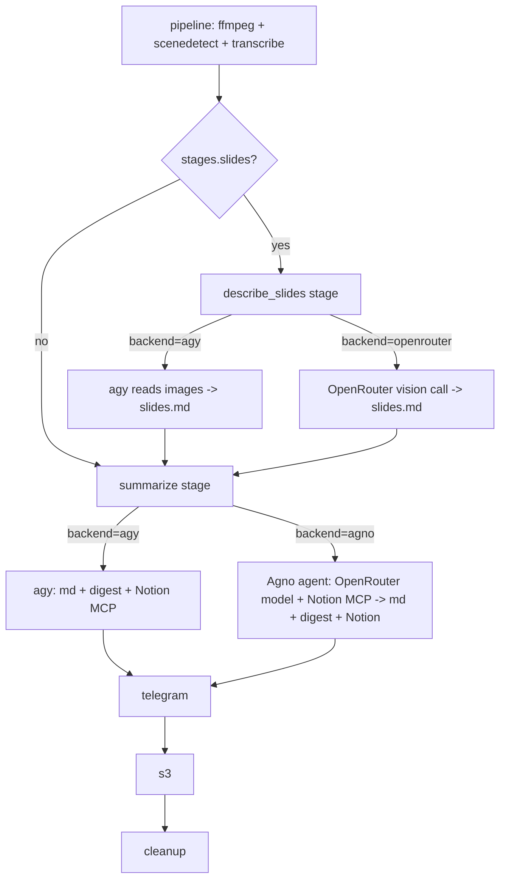

# Spec: Two Pluggable Post-Transcript Stages (Slide Description + Summarize) with Selectable Backends

## Problem Statement

Today a single heavy `agy` (local CLI agent) run does three things at once:
describes the extracted slide images (vision), summarizes the transcript, and
publishes to Notion + writes the Telegram digest. This couples an expensive
vision workload to the summary/publish workload and gives the operator no way to
choose a cheaper engine for either piece independently.

We want to **cleanly split the post-transcript work into two stages** and let
each stage's **backend be configured independently**:

1. **`describe_slides`** — turn the extracted slide images (+ transcript
   context) into a `<name>.slides.md` markdown block.
2. **`summarize`** — turn the transcript (+ the `<name>.slides.md` block) into
   the final `<name>.md` summary and `<name>.telegram.md` digest, and publish to
   Notion.

Each stage can run on a configurable **backend**, chosen per stage:

- **`describe_slides` backends:** `agy` (local CLI agent, today's behavior) or
  `openrouter` (a direct OpenRouter vision chat-completions call). Slide
  description touches no external tools, so a bare API call suffices here.
- **`summarize` backends:** `agy` (local CLI agent) or `agno` (an
  [Agno](https://docs.agno.com) agent driving a configurable OpenRouter model
  **with the Notion MCP server attached as a tool**). A bare OpenRouter
  chat-completions call is **not** an option for summarize, because **Notion MCP
  publishing is non-negotiable** and a plain API call cannot invoke MCP tools —
  only an agent framework (Agno, or `agy`) can. Agno gives us the cheaper/faster
  OpenRouter model *and* the required Notion MCP tool use.

The two selections are **orthogonal**: e.g. slides on `openrouter` + summarize on
`agno` (the primary cost-saving configuration), both on `agy` (today's
behavior), slides on `agy` + summarize on `agno`, or slides on `openrouter` +
summarize on `agy`.

## Motivation, Baseline & Success

- **Baseline (record BEFORE Task 2 — P1 checkpoint).** The ROI premise is that
  slide vision is the dominant cost of a slides-on `agy` run. Before implementing
  the backends, capture a rough baseline (wall time, and token/cost if the bridge
  surfaces it) for one representative slides-on recording with both stages on
  `agy`. **Stop/re-scope checkpoint:** if the projected saving from moving slides
  to `openrouter` is < 40% wall-time on that baseline, pause and reconsider scope
  before building the new backends — the added complexity is only justified by a
  real cost win. **If the checkpoint fails (P1):** Task 1's additive config stays
  in place but inert (both backends default to `agy`, so behavior is unchanged)
  and Tasks 2–7 are shelved — no revert needed.
- **Why per-stage backends instead of one global switch.** The two workloads
  have different needs: slide description is vision-heavy and stateless
  (great fit for a cheap vision API); summarize is text-heavy and must publish
  to Notion and write local files (needs the agent's MCP + file tools, or engine
  glue if done via API). Making the backend a per-stage choice lets the operator
  optimize each independently without degrading the other.
- **Alternatives considered / rejected (P3).** (a) A single global "cheap mode"
  toggle — rejected: couples the two workloads again and can't mix a cheap-vision
  + strong-summary configuration. (b) Passing a cheaper model id to `agy` for the
  slide sub-task — rejected: `agy`'s model isn't per-stage configurable from this
  engine, and a cheaper general agent degrades summary/Notion quality. The
  per-stage backend layer is the minimal abstraction that supports independent
  optimization.
- **Success criteria (P5 — concrete).** With slides on `openrouter` + summarize
  on `agy`: **≥ 40% wall-time reduction** on the baseline recording, with no
  visible quality regression in the "Slide Descriptions" section (manual parity
  check, Task 7). The 40% figure is the Task 7 pass/fail bar, scoped to the
  baseline recording(s) — **not** a guarantee across all recordings (P2); the
  parity check runs on **2–3 recordings of differing slide counts** (including
  one near the R23 ceiling, X3) to avoid a one-off favorable sample. **Cost is a
  secondary metric (P5):** capture token/$-cost at the P1 baseline when the
  bridge surfaces it and record it in Task 7, so a wall-time miss paired with a
  large cost win is a conscious decision rather than an automatic fail (motivation
  is cost; wall-time is the proxy).
- **Rollback.** Setting both stages' backend to `agy` reproduces today's
  behavior exactly; the split is additive, so rollback is a config change.

## Requirements

### Stage separation

- **R1.** The post-transcript work is split into two explicit, independently
  tracked stages: `describe_slides` (produces `<name>.slides.md`) and `summarize`
  (produces `<name>.md` + `<name>.telegram.md` and publishes to Notion).
- **R2.** `describe_slides` runs only when `stages.slides` is enabled. When
  disabled, no `<name>.slides.md` is produced and `summarize` omits the slide
  block (unchanged behavior).
- **R3.** `summarize` consumes `<name>.slides.md` **as text**. An absent or
  empty/whitespace `<name>.slides.md` is treated exactly like slides-off (block
  omitted).

### Backend selection

- **R4.** Each stage has an independent backend selector in config:
  `slides.backend` ∈ `{"agy","openrouter"}` and `summary.backend` ∈
  `{"agy","agno"}`. Defaults preserve current behavior: both default to `"agy"`.
- **R5.** All valid combinations behave correctly:
  `(slides=agy, summary=agy)` = today; `(slides=openrouter, summary=agy)` =
  primary cost saver; `(slides=agy, summary=agno)`;
  `(slides=openrouter, summary=agno)`.
- **R6.** Backend selection for one stage does not change the other stage's
  behavior, artifacts, or contracts. Both backends of a stage produce the same
  output artifact(s) with the same semantics.

### `describe_slides` behavior

- **R7.** `agy` backend: `agy` is driven (as today's slide path) to read the
  slide images and write `<name>.slides.md`. `openrouter` backend: a single
  chat-completions vision call produces the markdown.
- **R8.** Both backends reuse the existing `slide_extractor.md` rules so output
  format is preserved. Because the extractor requires per-slide
  `**Timestamp:** MM:SS - MM:SS` lines, per-slide scene timing (parsed from the
  scenes CSV) is provided to the backend: for `openrouter`, as a text part
  immediately before each image; for `agy`, alongside the image paths.
  Unknown timing is passed as `unknown`, never omitted.
  **Scenes-CSV location (E7 — empirically confirmed):** scenedetect writes the
  CSV into its `-o` directory, i.e. the **slides dir**
  `extracted_slides.<name>/<name>.scenes.csv`, **not** the recording dir. (Real
  host output confirms this: the CSV was found inside
  `extracted_slides.2026-09-24_Cognest_DeepRAP/`.) The implementation must resolve
  the CSV at that path (or pass scenedetect an absolute `-f` path so the location
  is deterministic) and `build_slide_inputs` must read it from there — not from a
  `.mp4` sibling. Note: `cleanup.intermediate_paths` currently looks for the CSV
  in the recording dir, where it never exists; it only gets removed today because
  the whole slides dir is `rmtree`'d. Task 7 should correct that path too.
- **R9.** Empty-result semantics: an empty image set or a valid empty backend
  response both resolve to an **empty `<name>.slides.md`**; the stage still
  completes successfully and is marked done. A backend *transport/format*
  failure raises `SlideDescribeError` (not triggered by an intentionally empty
  result).

### `summarize` behavior

- **R10.** `agy` summarize backend: unchanged — `agy` writes `<name>.md` +
  `<name>.telegram.md` and publishes to Notion via its own MCP (the current
  file-is-source-of-truth contract). `agno` summarize backend: an Agno agent runs
  a configurable OpenRouter model with the **Notion MCP server attached as a
  tool** and is instructed (via the existing `summary.md`/digest prompt) to write
  `<name>.md` + `<name>.telegram.md` and publish the Notion subpage — same
  observable outputs as the `agy` backend.
- **R11.** **Notion MCP is mandatory for summarize (non-negotiable).** Both
  summarize backends publish to Notion through the Notion **MCP** server, never a
  hand-rolled REST client and never skipped. This is precisely why the summarize
  backend options are `agy` and `agno` (both can drive MCP tools) and why a bare
  OpenRouter chat-completions call is excluded. **This is a policy choice (P3),
  not merely a technical limit:** we will not maintain a bespoke Notion REST
  client — MCP is the single, standardized Notion integration path — so even
  though one *could* call the Notion API directly for a summary blob, we
  deliberately do not. **The `agno` backend stands up its
  own Notion MCP server** — it does **not** inspect or reuse `agy`'s MCP
  configuration (that reverse-engineering would be a fragile hidden coupling).
  Instead, the config **explicitly requires a Notion API-key env-var name**
  (`notion.token_env`) whenever `summary.backend == "agno"`; the engine launches
  the official Notion MCP server (via Agno's `MCPTools`) with that key supplied
  through the MCP process environment. The key is secret-by-name (R12), resolved
  at use time, never stored in config and never logged. **MCP subprocess env
  (E4):** the child env is `os.environ` **merged** with `{token_env:
  resolved_key}` — never a bare replacement — so `PATH`/`APPDATA`/etc. survive
  (critical on Windows). **Windows launch (E4):** this engine is Windows-first;
  a bare `npx` often fails to spawn, so the command form must be
  Windows-launchable (e.g. `npx.cmd`/appropriate shim), confirmed in Task 6.
  Telegram dissemination is unaffected (the orchestrator reads the digest file
  regardless of backend).

### Cross-cutting (both backends / stages)

- **R12.** Secrets follow the existing pattern: config stores the OpenRouter
  API-key **env-var name** only; resolved at use time via `resolve_env`. No
  secrets in config.
- **R13.** `openrouter` connection config (`api_key_env`, `base_url`, and
  per-stage `model`) is configurable and shared by both OpenRouter consumers:
  the bare vision call (slides `openrouter` backend) and the Agno agent (summarize
  `agno` backend). `base_url` defaults to `https://openrouter.ai/api/v1`. The
  slides model defaults to a cheap vision model (`google/gemini-2.0-flash-001`);
  the summary model must be **capable enough for reliable tool/MCP use** — it is
  configured separately (`summary_model`) and should default to a solid
  tool-calling model (e.g. a stronger OpenRouter model), since weak models call
  MCP tools unreliably. Per-stage timeouts `timeouts.slides` (added, default
  900s) apply. The summarize-stage timeout is `timeouts.summarize` when set,
  otherwise falls back to `timeouts.agy` (E9): reusing `timeouts.agy` for both
  backends is convenient but a slower networked `agno`+MCP run may need more time
  than a fast local `agy`, so the optional `timeouts.summarize` lets operators
  mixing backends size it independently. Document the fallback in the README.
- **R14.** Pre-flight validation matches the selected backends. If **slides use
  `openrouter`** or **summary uses `agno`**, the `openrouter` section is required
  and its API-key env var is checked. If **summary uses `agno`**, the Notion
  prerequisites are required: `notion.token_env` must be set in config and the
  named env var must be present (the engine uses it to launch the Notion MCP —
  it does not depend on `agy`'s MCP setup). If a stage uses `agy`, the `agy`
  binary must be on PATH (existing check). Only the actually-used backends'
  prerequisites are required (e.g. slides `openrouter` +
  summary `agy` does not require Agno/Notion-token, but does require the
  OpenRouter key and `agy`).
- **R15.** Transient-failure resilience for `openrouter` calls: retry `429`/`5xx`
  with bounded exponential backoff before raising.
- **R16.** Privacy / data egress: any non-`agy` OpenRouter path sends content to
  a third party — the slides `openrouter` backend sends slide imagery +
  transcript context; the summarize `agno` backend sends transcript + slide
  markdown to the OpenRouter model (and the Notion MCP receives the summary).
  Documented in the spec and README. API key, auth headers, Notion token, and
  image bytes are never logged.
- **R17.** Observability: each OpenRouter path logs (INFO) the stage, model id,
  input size (slide count or transcript length), and elapsed time — never payload
  contents (R16). The `agno` backend additionally logs when the Notion MCP
  publish tool is invoked (tool name + result status, not content).
- **R18.** Cleanup deletes `<name>.slides.md`; `--keep-intermediates` preserves
  it; it is never confused with the durable `<name>.md`.
- **R19.** Failure isolation is per recording and per stage (existing manifest
  behavior). No silent cross-backend fallback: a selected backend's failure fails
  that stage (retryable), it does not silently switch to the other backend.
- **R20.** `notion` stage handling (E1). The manifest tracks `summarize` and
  `notion` separately. **Both** summarize backends (`agy` and `agno`) perform
  summary-write + Notion-publish within a **single agent run**, so both mark
  `summarize` + `notion` complete together (today's behavior is preserved for
  `agno` too — no engine-owned multi-step write). Inserting `describe_slides`
  changes the `STAGES` tuple; existing manifests predate the key and are treated
  as incomplete (`_completed.get(stage, False)`), so a re-run re-issues the slides
  call exactly once — stated explicitly.
- **R21.** Agent-run atomicity for summarize. Because both backends publish
  Notion inside the same agent run that writes the files, a Notion failure fails
  the whole `summarize`+`notion` stage for that recording (retryable), exactly as
  the current `agy` path behaves. There is no engine-side "files written but
  Notion pending" intermediate state to reconcile.
- **R22.** Truncation / incomplete-output guard for the `agno` backend: the
  agent must treat a truncated model turn as a failed run (surface it, fail the
  stage for retry) rather than persisting a truncated `<name>.md`. Reuse the
  existing "non-empty summary file" success check in `run_agent` as the
  post-condition (an empty/absent `<name>.md` after the run fails the stage).
- **R22b.** Hard time bound + subprocess cleanup for `agno` (E2/E3). The `agno`
  run is bounded by the summarize-stage timeout (`timeouts.summarize` or, when
  unset, `timeouts.agy` — R13/E9): the async run is wrapped so it cannot hang
  indefinitely (mirrors the `agy` path's `timeout`/`idle_timeout`). `MCPTools` is
  closed via a `finally`/async-context-manager on **every** path — success,
  exception, and timeout — so a spawned Notion MCP subprocess (`npx`/node) is
  never orphaned.
- **R23.** Deterministic payload bound (E5/E6). The `openrouter` slides backend
  enforces a concrete ceiling as module constants (e.g. max slides and/or max
  total encoded bytes). Exceeding it raises `SlideDescribeError` **before**
  sending, so the failure is deterministic rather than a provider-side `413`.
  **Long-deck behavior (E6 — decided):** over-ceiling decks **hard-fail** (no
  chunking, no silent fallback to `agy`), consistent with R19's no-silent-
  fallback rule. This is intentional: the operator gets a clear, deterministic
  error and can either raise the ceiling, choose `slides.backend=agy` for that
  host, or split the recording — rather than silently degrading quality or cost.
  The ceiling constant should be set generously (well above typical decks) so it
  triggers only on genuinely pathological inputs.
- **R24.** Operator visibility of selected backends. `--dry-run` and
  `transcriber check` show the chosen backend per stage (e.g. "slides:
  openrouter, summarize: agno") so the operator can confirm the run's engine mix
  before it executes.
- **R25.** Downscaling is a size/cost control, **not** redaction (E5). The
  README privacy note must state that reducing image resolution lowers but does
  not eliminate the fidelity of sensitive on-slide content; operators must not
  treat downscaling as masking — sensitive material still egresses.

## Background (Codebase Internals)

- **`transcriber/agent.py`**
  - `_slide_block(slide_image_paths)` reads `prompt_templates/slide_extractor.md`
    and lists image paths in a "Slide descriptions" instruction block; `""` when
    no slides.
  - `build_prompt(...)` threads the slide block into
    `prompt_templates/summary.md`'s `{slide_block}` placeholder; transcript is
    wrapped in a non-XML Markdown fence (`_transcript_fence` / `_fence_for`).
  - `run_agent(config, transcript_path, recording_dir, slide_image_paths)`
    resolves the output path, builds the prompt (`inline_transcript=False`),
    exposes the workspace via `add_dirs`, and drives `agy` through
    `agy_headless_bridge.run`. `agy` writes `<name>.md` + `<name>.telegram.md`
    and publishes to Notion via MCP.
- **`transcriber/pipeline.py`** — `process_recording` runs ffmpeg → scenedetect
  (optional) → transcribe (`--format text` → `.txt`). Idempotent per stage.
  `_run_command` is the single child-process seam (monkeypatched in tests).
- **`transcriber/__main__.py`** — `_process_one` drives stages via the state
  manifest: `pipeline` → `summarize`(+`notion`) → `telegram` → `s3` → `cleanup`.
  `_slide_image_paths(mp4, config)` lists `extracted_slides.<name>/*.jpg`.
  `_transcript_path` → `<name>.txt`. `_enabled_stage_names` builds the dry-run
  plan; `preflight_check` / `_required_env_vars` verify binaries + env vars.
- **`transcriber/state.py`** — `STAGES = (pipeline, summarize, notion, telegram,
  s3, cleanup)`; only listed stages tracked; `mark_complete` persists at once.
- **`transcriber/cleanup.py`** — `INTERMEDIATE_SUFFIXES = (".mp3", ".txt",
  ".scenes.csv")`; `intermediate_paths` also lists `<name>.telegram.md` + the
  slides dir; `KEEP_SUFFIXES = (".mp4", ".md")`; `_has_keep_suffix`
  special-cases `.telegram.md` so the digest is deletable.
- **`transcriber/config.py`** — dataclass model + `_build_section`; optional
  sections (`s3`) present-or-`None`; `Timeouts` fields default to 900;
  `resolve_env` resolves secrets at use time.
- **Telegram** — the orchestrator reads `<name>.telegram.md` (fallback
  `<name>.md`) and sends it; independent of the summarize backend.
- **Dependencies** — `httpx` already declared (used by the slides `openrouter`
  vision call). The summarize `agno` backend adds **`agno[mcp]`** plus an
  OpenRouter-capable model provider (Agno's `OpenRouter` model, or `OpenAILike`
  with `base_url`) as a **new dependency**; it is only needed when
  `summary.backend == "agno"`.
- **OpenRouter (slides vision call)** — OpenAI-compatible
  `POST {base_url}/chat/completions`. Vision: message `content` parts of
  `{"type":"text",...}` and
  `{"type":"image_url","image_url":{"url":"data:image/jpeg;base64,<b64>"}}`.
  Header `Authorization: Bearer <key>`; response at `choices[0].message.content`.
- **Agno + Notion MCP (summarize agno backend)** — Agno exposes MCP servers to an
  agent via `agno.tools.mcp.MCPTools` (`command="..."` for a stdio server, or
  `url=...` for streamable-http), attached through `Agent(model=..., tools=[...])`
  with `connect()`/`close()` (or async context manager) lifecycle. The model is an
  OpenRouter model (`agno.models.openrouter.OpenRouter` or `OpenAILike` +
  `base_url`). The Notion MCP server is launched **by the engine** (via
  `MCPTools(command=...)`) using the official Notion MCP server, with the Notion
  API key supplied through the MCP process env from
  `resolve_env(config.notion.token_env)`. The engine does **not** read `agy`'s
  MCP configuration — the `agno` path is self-contained and configured only by
  `notion.token_env` (+ the existing `notion.parent_page_id`/`insert`).

## Proposed Solution

### Stage/backend structure

Two stages, each behind a small **backend interface**, selected by config:

```
describe_slides stage  -> backend in {AgySlidesBackend, OpenRouterSlidesBackend}
summarize stage        -> backend in {AgySummarizeBackend, AgnoSummarizeBackend}
```

- Each stage is a manifest-tracked orchestrator step in `__main__._process_one`.
  The `pipeline` stage stays ffmpeg + scenedetect + transcribe only (no network).
- `describe_slides` (when `stages.slides`) runs after `pipeline`, before
  `summarize`, and writes `<name>.slides.md`. Manifest-gated so a paid backend
  call is not re-issued on retry.
- `summarize` reads the transcript + `<name>.slides.md` and produces `<name>.md`
  + `<name>.telegram.md` **and publishes to Notion via MCP**. Both backends yield
  the same artifacts and both use the Notion MCP (R11).



### Config model additions

```python
SLIDES_BACKENDS = ("agy", "openrouter")
SUMMARY_BACKENDS = ("agy", "agno")

@dataclass
class SlidesStage:
    enabled: bool                 # was stages.slides
    backend: str = "agy"          # "agy" | "openrouter"

@dataclass
class Summary:                    # existing; add backend
    language: str                 # "en" | "original"
    sections: list[str]
    backend: str = "agy"          # "agy" | "agno"

@dataclass
class OpenRouter:
    api_key_env: str
    base_url: str = "https://openrouter.ai/api/v1"
    slides_model: str = "google/gemini-2.0-flash-001"   # vision (slides call)
    summary_model: str = "google/gemini-2.5-pro"        # tool-capable (agno + MCP)

@dataclass
class Notion:                     # existing; add MCP token env-var name
    server: str
    parent_page_id: str
    insert: str
    token_env: str | None = None  # env-var NAME for the Notion API key. The
                                  # engine launches the Notion MCP with this key.
                                  # Required when summary.backend == "agno".

@dataclass
class Timeouts:
    ffmpeg: int = 900
    scenedetect: int = 900
    slides: int = 900             # NEW (describe_slides stage)
    elevenlabs: int = 900
    agy: int = 900
    summarize: int | None = None  # NEW; summarize-stage timeout, falls back to agy
    s3: int = 900

# Config: openrouter: Optional[OpenRouter] = None
# Validation:
#   - slides.backend in SLIDES_BACKENDS; summary.backend in SUMMARY_BACKENDS.
#   - openrouter required iff (slides.backend == "openrouter") or
#     (summary.backend == "agno").
#   - notion.token_env required iff summary.backend == "agno".
```

Note the `summary_model` default is a **tool-capable** model, not the cheap
vision model — reliable MCP tool calling needs a stronger model (R13).

Config migration (no legacy): the existing `stages.slides: bool` is **replaced**
by the nested `stages.slides: {enabled, backend}` shape. There is **no**
backward-compatible bool acceptance — a bare `stages.slides: true/false` is a
`ConfigError`. All in-repo configs/examples (and any host configs) must adopt the
nested shape. This is safe because the engine is consumed as a submodule and its
configs are updated in lockstep (Task 6 updates the examples).

### Backend interfaces (sketch)

```python
# transcriber/backends/slides.py
class SlidesBackend(Protocol):
    def describe(self, slides: Sequence[SlideInput], transcript_text: str,
                 config: Config, *, timeout: float) -> str: ...

# transcriber/backends/summarize.py
class SummarizeBackend(Protocol):
    def summarize(self, transcript_path: Path, slides_markdown: str | None,
                  recording_dir: Path, config: Config) -> SummaryResult: ...
    # SummaryResult: paths to <name>.md and <name>.telegram.md (both written).
```

- `AgySlidesBackend` drives `agy` to write `<name>.slides.md` (reuses the
  existing prompt-building + `run_agent` seam, scoped to the slides sub-task).
- `OpenRouterSlidesBackend` = the single vision chat-completions call
  (timestamps + downscale + retry) described below.
- `AgySummarizeBackend` = today's `run_agent` (writes md + digest + Notion MCP).
- `AgnoSummarizeBackend` = an Agno agent (OpenRouter model via
  `agno.models.openrouter.OpenRouter` / `OpenAILike`) with the **Notion MCP**
  attached via `MCPTools`, instructed by the same summary/digest prompt to write
  `<name>.md` + `<name>.telegram.md` and create the Notion subpage. Same
  file-is-source-of-truth + Notion contract as `agy`; the engine reads the files
  back after the run (reuse the existing non-empty-summary post-condition, R22).
  Runs async internally (Agno is async); the orchestrator step wraps it (e.g.
  `asyncio.run`). `MCPTools` connection is opened/closed per run (R11).

### Agno summarize backend (sketch)

```python
# transcriber/backends/summarize_agno.py  (only imported when backend == "agno")
from agno.agent import Agent
from agno.models.openrouter import OpenRouter as AgnoOpenRouter
from agno.tools.mcp import MCPTools

async def _run(prompt, config, recording_dir):
    notion_token = resolve_env(config.notion.token_env)
    # Engine launches the official Notion MCP server itself (no agy dependency).
    # e.g. command="npx -y @notionhq/notion-mcp-server" with the API key in env.
    async with MCPTools(
        command=NOTION_MCP_COMMAND,
        env={NOTION_MCP_TOKEN_ENV: notion_token},   # key passed to the MCP process
    ) as mcp:
        agent = Agent(
            model=AgnoOpenRouter(id=config.openrouter.summary_model,
                                 api_key=resolve_env(config.openrouter.api_key_env),
                                 base_url=config.openrouter.base_url),
            tools=[mcp],
        )
        await agent.arun(prompt)   # prompt instructs: write files + publish Notion
```

`NOTION_MCP_COMMAND` / `NOTION_MCP_TOKEN_ENV` are engine-owned constants for the
official Notion MCP server (confirm the exact package/env-var name during Task 6
from Notion's MCP docs). The prompt is the existing summary/digest directive set
(`summary.md` + digest step + Notion-publish step), reused verbatim so both
summarize backends share one prompt contract.

### OpenRouter vision call (slides backend)

Behavior mirrors the prior design: resolve key via `resolve_env`; read
`slide_extractor.md`; build one user message = leading text part (rules +
language + transcript context), then per slide a `Timestamp: MM:SS - MM:SS` text
part (from `extracted_slides.<name>/<name>.scenes.csv`; `unknown` when missing) +
`image_url` part; **downscale** each JPEG to a bounded long edge (module
constant, e.g. 1024 px) before base64; headers `Authorization`, `HTTP-Referer`,
`X-Title`; POST with `timeout`; retry `429`/`5xx` with bounded backoff; return
`choices[0].message.content` (empty/whitespace → `""`). Single call bounds
cost/latency and preserves cross-slide dedup. **Deterministic ceiling (R23):**
module constants cap max slides and/or total encoded bytes; exceeding them raises
`SlideDescribeError` **before** sending, rather than risking a provider `413`.

## Task Breakdown

### Task 1 — Config: per-stage `backend`, `openrouter` section, validation

**Objective.** Generalize `stages.slides` to carry a `backend`; add
`summary.backend`; add an optional `OpenRouter` section (api_key_env, base_url,
slides_model, summary_model); add `notion.token_env`; add `timeouts.slides` and
the optional `timeouts.summarize` (E9; `None` default → falls back to
`timeouts.agy` at use time).
Validate `slides.backend` against `("agy","openrouter")` and `summary.backend`
against `("agy","agno")`. Require `openrouter` iff (slides=openrouter or
summary=agno); require `notion.token_env` iff summary=agno.

**Implementation guidance.** Require the nested `stages.slides: {enabled,
backend}` shape — **no legacy bool acceptance** (a bare `stages.slides: bool` is
a `ConfigError`). Follow the `S3` optional-section pattern for `openrouter`. Put
backend-value validation and the cross-field requirements (openrouter-iff-used;
notion-token-iff-agno) next to the `summary.language` validation.

**Test requirements** (`tests/test_config.py`):
- Defaults: omitted backends → both `"agy"`; no `openrouter`/`notion.token_env`
  needed.
- `slides.backend: openrouter` (or `summary.backend: agno`) without `openrouter`
  → `ConfigError`.
- `summary.backend: agno` without `notion.token_env` → `ConfigError`.
- Invalid backend value → `ConfigError` listing allowed values for that stage
  (note `summary` allows `agno` not `openrouter`, and vice versa).
- `openrouter` parses `base_url`/`slides_model`/`summary_model` defaults.
- A bare `stages.slides: true/false` (legacy bool) → `ConfigError` (no
  backward-compat); only the nested `{enabled, backend}` shape is accepted.
- `timeouts.slides` defaults to 900 and is overridable; `timeouts.summarize`
  defaults to `None` and falls back to `timeouts.agy` at use time.

**Demo.** Load each valid combination; show the missing-`openrouter` and
missing-`notion.token_env` errors; show an invalid backend value rejected.

### Task 2 — Backend interfaces + OpenRouter vision-call helper

**Objective.** Introduce the `SlidesBackend` / `SummarizeBackend` interfaces and
the OpenRouter HTTP helper used by the **slides** vision call (auth headers,
retry/backoff, log hygiene, error type). No stage wiring yet. (The summarize
`agno` backend does not use this helper — it goes through Agno; Task 4/6.)

**Implementation guidance.** Add `transcriber/backends/` (or top-level modules).
Helper `_openrouter_vision(config, messages, model, *, timeout) -> str` handling
headers (`Authorization`+`HTTP-Referer`+`X-Title`), `429`/`5xx` retry, and
`SlideDescribeError` on transport/format failure. Log hygiene: never include
key/headers/base64 in errors or logs.

**Test requirements** (`tests/test_backends.py`, mock `httpx`):
- Helper sends `Authorization`+`HTTP-Referer`+`X-Title`, correct URL, model.
- Retry `429`→`200` succeeds (patch sleep); persistent `5xx` → error after cap.
- Malformed JSON / missing content → error.
- Errors carry status + short snippet only (no secrets/bytes).

**Demo.** Drive the helper against a mocked transport for success, retry, and
failure.

### Task 3 — Slides backends (agy + openrouter) + slide-input helper

**Objective.** Implement `AgySlidesBackend` and `OpenRouterSlidesBackend`, plus
`build_slide_inputs(recording_dir, name)` (ordered images joined to scene timing;
missing → `unknown`; zero images → `[]`). Both backends write/return the slide
markdown; empty result → `""` (R9). Pipeline stays network-free.

**Implementation guidance.** OpenRouter backend = the vision call above
(timestamps, downscale, single request, R23 deterministic bound). Agy backend =
a scoped `agy` run that writes `<name>.slides.md` only (reuse prompt building).
Neither lives in `process_recording`.
**Scenes-CSV path (E7 — must be explicit).** scenedetect writes the CSV into its
`-o` dir, so it lives at `extracted_slides.<name>/<name>.scenes.csv`, NOT beside
the `.mp4`. Either (a) change `pipeline._extract_slides` to pass an **absolute**
`-f` path so the location is pinned, and/or (b) have `build_slide_inputs` read
from `extracted_slides.<name>/<name>.scenes.csv` explicitly. Do **not** assume a
`.mp4` sibling. Missing/unparseable CSV → `unknown` per slide (a degraded path,
R8), and the implementation should log a warning so the silent-no-op is visible.

**Test requirements** (`tests/test_backends.py` / `tests/test_slides.py`):
- `build_slide_inputs`: reads the CSV from the **slides dir**; stable order,
  timing joined from a fixture CSV placed at `extracted_slides.<name>/`; `unknown`
  on miss (with a warning), `[]` on zero images.
- OpenRouter backend request shape: one `image_url` per slide, `Timestamp:` part
  before each; empty images → no HTTP call, returns `""`; over-bound input →
  `SlideDescribeError` before any HTTP call (R23).
- Agy backend (mock `run_agent`): writes `<name>.slides.md`.
- `pipeline.process_recording` makes no slides-backend call.

**Demo.** Run each backend (mocked) over a fixture slides dir (CSV in the slides
dir) → `<name>.slides.md`.

### Task 4 — Summarize backends (agy + agno)

**Objective.** Implement `AgySummarizeBackend` (today's `run_agent`) and
`AgnoSummarizeBackend` (an Agno agent using an OpenRouter model + the Notion MCP
that writes `<name>.md` + `<name>.telegram.md` and publishes the Notion subpage).
Both take `slides_markdown` (text) and omit the slide block when empty (R3). Both
publish Notion via MCP (R11).

**Implementation guidance.** Refactor `agent.py` so `_slide_block` accepts
`slides_markdown: str | None` (embed fenced text when non-empty; omit when
empty/whitespace) — no image paths. `AgySummarizeBackend` keeps the
file-is-source-of-truth + Notion-via-MCP contract unchanged. `AgnoSummarizeBackend`
lives in its own module imported only when selected (so `agno` is an optional
import); it builds the **same** prompt directive set as `agy` (write summary +
digest files, then create the Notion subpage), constructs an Agno `Agent` with
`AgnoOpenRouter(id=summary_model, api_key=resolve_env(...), base_url=...)` and
`MCPTools` for the Notion server (token via `resolve_env(config.notion.token_env)`
in the MCP env), runs it (async; wrap with `asyncio.run` in the sync
orchestrator), **bounded by `timeouts.agy`** (R22b) and closing `MCPTools` in a
`finally`/async-context-manager on success, error, **and timeout** (R22b/E3).
After the run, apply the existing **non-empty `<name>.md` post-condition** (R22):
an empty/absent summary file fails the stage. Agent-run atomicity (R21): a
Notion-publish failure inside the run fails the whole `summarize`+`notion` stage
(retryable), like `agy`.

**Test requirements** (`tests/test_agent.py` / `tests/test_backends.py`):
- `_slide_block` embeds markdown when non-empty; omits on `None`/`""`/whitespace;
  no image paths in the prompt.
- Agy summarize: existing behavior/tests intact (writes md/digest, Notion prompt).
- Agno summarize (mock the Agno `Agent`/`MCPTools`): builds a model with
  `summary_model` + resolved key/base_url, attaches the Notion MCP with the token
  resolved by env-var name, runs the shared prompt; a run leaving an empty/absent
  `<name>.md` → stage failure (R22); the run is bounded and `MCPTools.close()`
  (context-exit) runs on the **exception/timeout** path too (R22b/E3).
- **(E8)** log-hygiene: capture logs during a mocked `agno` run and assert the
  resolved OpenRouter key, the Notion token, and image bytes are absent.

**Demo.** Produce a summary via `agy` (mocked bridge) and via `agno` (mocked Agno
agent + MCP) and show both write `<name>.md` + `<name>.telegram.md`; show an
empty-summary run failing the stage.

### Task 5 — Orchestrator wiring (`__main__.py` + `state.py`)

**Objective.** Add the manifest-tracked `describe_slides` stage (gated on
`stages.slides.enabled`) that selects and runs the configured slides backend and
writes `<name>.slides.md`; change the `summarize` stage to select and run the
configured summarize backend, passing the slide markdown. Feed Telegram from the
digest as today.

**Implementation guidance.**
- `state.py`: the target tuple is **exactly**
  `STAGES = (pipeline, describe_slides, summarize, notion, telegram, s3, cleanup)`
  (`describe_slides` inserted after `pipeline`). Update the docstring "Tracked
  stages" list to this tuple and any `STAGES`-tuple-asserting test. **Manifest
  migration (R20):** existing manifests predate `describe_slides` and lack the
  key; `_completed.get(stage, False)` already treats them as incomplete, so a
  re-run re-issues the slides call exactly once — state this in the docstring.
- `_process_one`: `describe_slides` step (manifest-gated) → build slide inputs,
  read transcript, run slides backend, write `<name>.slides.md` (idempotent skip
  if present), log stage/model/size/elapsed (R17), mark complete. Then the
  `summarize` step selects the backend and runs it. **`notion` stage marking
  (R20):** both summarize backends (`agy` and `agno`) write files + publish
  Notion in a single agent run, so mark `summarize`+`notion` together (unchanged
  from today). A backend failure fails the recording (isolated); an empty slide
  result writes an empty file and completes.
- Backend selection = pure function of config (`slides.backend`,
  `summary.backend`).
- `_enabled_stage_names` — **pin the tokens (E1/X1)** to remove the "slides"
  naming collision. Rename the existing pipeline slide-extraction token from
  `slides` to **`scene-extract`**. Add **`describe-slides [<backend>]`** after
  `transcribe` when slides on. Standardize the summarize token as
  **`summarize+notion [<backend>]`** (keep the `+notion` suffix — it signals the
  R20/R21 atomicity). So a slides-on plan reads:
  `audio-extract, scene-extract, transcribe, describe-slides [openrouter],
  summarize+notion [agno], telegram, s3-sync`.
- `preflight_check`/`_required_env_vars`: require the OpenRouter env var iff
  (slides=openrouter or summary=agno); require the Notion token env var iff
  summary=agno; require `agy` on PATH iff a stage uses `agy`; **(R24)** show the
  selected backends in `check` output.

**Test requirements** (`tests/test_main.py`, monkeypatch backends):
- Dry-run plan uses the pinned tokens: pipeline extraction is `scene-extract`
  (not `slides`); the new stage is `describe-slides [<backend>]`; summarize is
  `summarize+notion [<backend>]`. **Update the existing test** that asserts
  `"slides" in stages` to `"scene-extract" in stages`.
- `describe-slides` appears only when slides on, annotated with the chosen
  backend.
- Correct backend chosen per config for each valid combination.
- `describe_slides` manifest-gated: skipped on retry when complete.
- Summarize receives slide markdown; no image paths.
- Pre-flight requires the OpenRouter env var iff slides=openrouter or
  summary=agno; the Notion token env var iff summary=agno; `agy` iff a stage
  uses it.
- **(R24)** `--dry-run` and `check` show the selected backend per stage.
- **(E7)** shared-config-distinct-models: the slides backend uses
  `openrouter.slides_model` and the `agno` backend uses `openrouter.summary_model`
  from the **same** `openrouter` block (they must not cross-wire).

**Demo.** `--dry-run` shows `scene-extract, transcribe, describe-slides
[openrouter], summarize+notion [agno]`; a mocked (openrouter, agy) run writes
`<name>.slides.md` then summarizes via `agy`; a re-run skips the paid slides
call.

### Task 6 — Agno dependency + Notion MCP wiring for the summarize backend

**Objective.** Make the `agno` summarize backend actually publish to Notion via
MCP: add the optional dependency, wire the Notion MCP server into the Agno agent,
and resolve the Notion token by env-var name.

**Implementation guidance.**
- Add `agno[mcp]` (+ the OpenRouter model provider) as an **optional dependency**
  in `pyproject.toml` (e.g. an `agno` extra), **version-pinned** (`~=` or exact,
  not an open range — E10) so a minor Agno release can't silently break the
  summarize path. Import it only inside `AgnoSummarizeBackend`; when
  `summary.backend == "agno"` and the import fails, raise a clear error telling
  the operator to install the extra. Confirm the exact Agno API surface
  (`agno.models.openrouter.OpenRouter`, `agno.tools.mcp.MCPTools`, `Agent.arun`)
  against the pinned version during implementation (E10).
- **Launch the official Notion MCP server from the config'd API key — do NOT
  inspect or reuse `agy`'s MCP configuration.** Define engine-owned constants for
  the Notion MCP invocation (the official Notion MCP server package/command and
  its API-key env-var name); confirm the exact package + env-var name from
  Notion's MCP documentation during implementation. Pass the key via the MCP
  process env: **`os.environ` merged with `{token_env: resolved_key}`** (never a
  bare replace — `PATH`/`APPDATA` must survive on Windows, E4). **Windows launch
  (E4):** confirm a Windows-launchable command form (e.g. `npx.cmd` / shim), as a
  bare `npx` frequently fails to spawn on Windows — this is the most likely
  first-run blocker. Attach via `MCPTools`, close on every path (R22b); give the
  agent the shared summary/digest+Notion prompt (Task 4). This keeps the `agno`
  path fully self-contained and configured only by `notion.token_env` (+
  `notion.parent_page_id`/`insert`).

**Test requirements.**
- Mock `MCPTools` + Agno `Agent`: assert the engine launches the Notion MCP with
  the API key resolved by env-var name (never inlined/logged) and passed in the
  MCP env; the agent is asked to publish; the connection is closed after the run.
- **(E4)** the MCP subprocess env is `os.environ` merged with the token (assert
  a sentinel `os.environ` key survives alongside the token), not a bare replace.
- **(E3)** `MCPTools` context-exit/`close()` runs on the **exception** path (make
  the mocked agent raise mid-run; assert close was still called).
- No reference to `agy`'s MCP config anywhere in the `agno` path.
- Missing `agno` import when `summary.backend=agno` → clear actionable error.
- Missing `notion.token_env` env var → caught at pre-flight (R14), not mid-run.

**Demo.** With Agno + Notion MCP mocked, run an (any, agno) summarize and show
the engine launching the Notion MCP with the key from env, the publish tool
invoked, and both files written. **Windows spawn smoke test (X2):** on a Windows
host, confirm the real Notion MCP command actually spawns (env merged, correct
shim) before the Task 7 parity run — this is the riskiest new runtime path.

### Task 7 — Cleanup, docs/config, verification

**Objective.** Cleanup for `<name>.slides.md`; docs/examples for the new config;
full verification.

**Implementation guidance.**
- `cleanup.py`: add `".slides.md"` with a `_has_keep_suffix` special-case (like
  `.telegram.md`) so it is deletable while `<name>.md` is kept; add to
  `intermediate_paths`; `--keep-intermediates` preserves it. **Also fix the
  scenes-CSV path (E7):** `intermediate_paths` currently points at
  `directory/<name>.scenes.csv` (recording dir) where the file never exists —
  correct it to `extracted_slides.<name>/<name>.scenes.csv`, or rely on the
  slides-dir `rmtree` and drop the stale recording-dir candidate.
- `README.md`: document the two stages, the per-stage `backend` selector
  (slides: `agy`|`openrouter`; summarize: `agy`|`agno`), the valid combinations,
  the `openrouter` section + `timeouts.slides`, and a
  **privacy note** (R16) that non-`agy` OpenRouter paths egress content to a
  third party. **(E4)** The privacy note must add that slide images (often the most
  sensitive material) are uploaded and that upstream **retention** is outside the
  engine's control, so operators in regulated contexts should keep both stages on
  `agy`. **(R25/E5)** state that image downscaling is a size/cost control, **not**
  redaction — sensitive on-slide content still egresses. Document the
  `summary.backend` options (`agy` | `agno`), the `agno`
  backend's `notion.token_env` + `agno` optional-dependency requirement, the
  optional `timeouts.summarize` (falls back to `timeouts.agy`; recommend raising
  it for `agno`+MCP — E9), and the R24 per-stage backend visibility.
- `examples/example.config.yaml` / `acme.config.yaml`: show the new shape
  (e.g. example = both `agy` (no `openrouter` needed); acme = slides `openrouter`
  + summarize `agno` with an `openrouter` block and `notion.token_env`, env-var
  names only).
- Host config edits are **out of scope** (host repos own their configs; provide
  a follow-up note for host maintainers, including the `agno` extra install when
  they choose `summary.backend=agno`).

**Test requirements.**
- `tests/test_cleanup.py`: deletes `<name>.slides.md`, keeps `<name>.md`/`.mp4`;
  `--keep-intermediates` preserves it.
- `tests/test_examples.py`: example configs load; backends parse; `openrouter` +
  `notion.token_env` present where used.

**Demo.** `uv run pytest -q` green. Manual parity check (success bar): one real
slides-on recording with slides `openrouter` + summarize `agy` (and separately
+ summarize `agno`); confirm ≥40% wall-time reduction vs. all-`agy` and eyeball
the Slide Descriptions + Notion page for parity.

## Open Decisions (resolve during implementation)

- **D1 — RESOLVED (Notion MCP is non-negotiable).** The summarize stage always
  publishes to Notion via the Notion **MCP** server. Bare OpenRouter cannot call
  MCP tools, so the summarize backend options are `agy` and `agno` (both drive
  MCP); a plain-API summarize path is excluded. No engine-owned REST Notion
  client and no skip-with-warning.
- **D2 — RESOLVED (no legacy):** require the nested `stages.slides: {enabled,
  backend}` shape; a bare `stages.slides: bool` is a `ConfigError`. No
  backward-compat coercion. All in-repo examples adopt the nested shape (Task 6).
- **D3 — Scope (RESOLVED): ship all valid backend combinations in one cut.** Both
  the slides `openrouter` backend and the summarize `agno` backend ship together
  as a consciously-accepted tradeoff. Consequence: the `agno` summarize path is
  in-scope now (R11 Notion-MCP, R20/R21 stage/atomicity, R22 post-condition,
  Task 6 dependency), reflected in Tasks 4–6 and their tests.

## Defaults / Decisions

- **Backends default to `agy`** for both stages → today's behavior with no config
  change (R4).
- **Orthogonal selection:** the two backend choices are independent (R5/R6).
- **Slides backend options `agy` | `openrouter`; summarize options `agy` |
  `agno`.** Slides touch no external tools (bare vision API is fine); summarize
  must use Notion MCP (only `agy`/`agno` can).
- **Single owner for paid calls:** the slides `openrouter` call lives in the
  manifest-gated `describe_slides` step, not in `pipeline.process_recording`, so
  retries don't re-issue it.
- **Slides OpenRouter call:** single request, per-slide timestamps from
  `scenes.csv`, JPEG downscale to a bounded long edge, `429`/`5xx` backoff,
  deterministic payload ceiling (R23).
- **Summarize via Agno:** OpenRouter model (tool-capable `summary_model`) + Notion
  MCP via `MCPTools`; same file+Notion contract as `agy`; agent-run atomicity
  (R21); non-empty-summary post-condition (R22).
- **No silent fallback (R19):** a selected backend's failure fails the stage
  (retryable); it never silently switches backends. A *valid empty* slide result
  is not a failure.
- **Notion (R11):** always via MCP, both summarize backends. Non-negotiable.
- **Privacy (R16) / Observability (R17):** documented egress; per-call INFO logs
  of stage/model/size/elapsed; secrets, tokens, and bytes never logged.
- **Dependencies:** `httpx` already declared (slides vision call). `agno[mcp]` +
  an OpenRouter model provider is a **new optional dependency**, needed only when
  `summary.backend == "agno"`.
