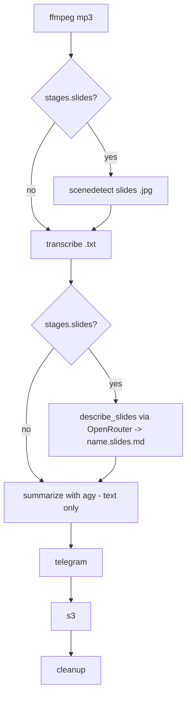

# Spec: Offload Slide Description to a Cheap OpenRouter Vision Model

## Problem Statement

Slide description is currently performed inside the heavy `agy` agent run. The
agent receives the extracted slide image paths, opens each image (vision), and
writes the "Slide Descriptions" section as part of the same run that summarizes
the transcript and publishes to Notion. Vision work on the heavy agent is the
expensive part of the run.

We want to move slide description out of `agy` into a dedicated stage that calls
a cheaper, configurable **OpenRouter** vision model. After this change, `agy`
becomes a **text-only** summarizer + publisher: it consumes a pre-generated
slide-descriptions markdown file as text and no longer performs any vision work.

## Requirements

- **R1.** When `stages.slides` is enabled, slide description is produced by a
  dedicated pipeline stage that calls OpenRouter's image-understanding
  (chat-completions) API with a cheap, configurable model.
- **R2.** The stage writes a `<name>.slides.md` intermediate artifact. The
  summarize stage (`agy`) then consumes that markdown **as text** and no longer
  receives image paths or performs vision.
- **R3.** Secrets follow the existing pattern: the config stores the OpenRouter
  API-key **environment-variable name** only; the value is resolved at *use*
  time via `resolve_env`. No secrets are stored in config.
- **R4.** When `stages.slides` is disabled, behavior is unchanged: no slide
  stage runs and no slide block appears in the summary prompt.
- **R5.** Failure isolation: an OpenRouter failure fails the slides stage for
  that recording (retryable via the state manifest). It does **not** silently
  fall back to the expensive `agy` vision path.
- **R6.** The existing `slide_extractor.md` rules are reused as the vision
  prompt so output format and quality are preserved.
- **R7.** Cleanup deletes `<name>.slides.md`; `--keep-intermediates` preserves
  it. The `<name>.slides.md` intermediate must never be confused with the
  durable `<name>.md` summary.
- **R8.** The OpenRouter model, base URL, and API-key env-var name are
  configurable. The model defaults to a cheap vision model
  (`google/gemini-2.0-flash-001`); the base URL defaults to
  `https://openrouter.ai/api/v1`. A per-stage `timeouts.slides` key is added
  (default 900s).
- **R9.** Pre-flight validation: when `stages.slides` is enabled, the config
  must include an `openrouter` section, and the referenced API-key env var is
  checked in the pre-flight check.

## Background (Codebase Internals)

- **`transcriber/agent.py`**
  - `_slide_block(slide_image_paths)` reads `prompt_templates/slide_extractor.md`
    and renders a "Slide descriptions" instruction block listing the image
    paths. Returns `""` when there are no slides (so the prompt has no slide
    instructions at all).
  - `build_prompt(config, transcript_path, slide_image_paths, *, output_file,
    digest_file, inline_transcript)` threads the slide block into
    `prompt_templates/summary.md`'s `{slide_block}` placeholder. Transcript is
    wrapped in a non-XML Markdown code fence (`_transcript_fence`) with a
    fence-length guard (`_fence_for`).
  - `run_agent(config, transcript_path, recording_dir, slide_image_paths)`
    resolves the output path, builds the prompt with `inline_transcript=False`
    (agy reads the transcript file by absolute path — the full transcript would
    overflow the Windows command line), exposes the host workspace via
    `add_dirs`, and drives `agy` through `agy_headless_bridge.run`.
- **`transcriber/pipeline.py`**
  - `process_recording` runs, in order: ffmpeg (mp4→mp3), scenedetect (optional,
    slides), transcribe (mp3→`.txt` via `elevenlabs ... --format text`). Each
    stage is idempotent (skips when its output already exists). `_run_command`
    is the single child-process seam (monkeypatched in tests).
  - `RecordingResult.new_artifacts` currently tracks a subset of
    `{"mp3", "slides", "txt"}`.
- **`transcriber/__main__.py`**
  - `_slide_image_paths(mp4, config)` returns the sorted `.jpg` files under
    `extracted_slides.<name>/` when slides are enabled, else `[]`.
  - `_transcript_path(mp4, config)` returns `<name>.txt`.
  - `_process_one` drives stages using the state manifest: `pipeline` →
    `summarize`(+`notion`) → `telegram` → `s3` → `cleanup`. The summarize step
    calls `run_agent(config, _transcript_path(...), mp4.parent,
    _slide_image_paths(...))`.
  - `_enabled_stage_names` builds the dry-run plan. `preflight_check` verifies
    required binaries and env vars; `_required_env_vars` currently returns the
    Telegram token env-var name.
- **`transcriber/state.py`** — ordered stage manifest
  `STAGES = (pipeline, summarize, notion, telegram, s3, cleanup)`; only listed
  stages are tracked; `mark_complete` persists immediately.
- **`transcriber/cleanup.py`** — `INTERMEDIATE_SUFFIXES = (".mp3", ".txt",
  ".scenes.csv")`; `intermediate_paths` also lists `<name>.telegram.md` and the
  `extracted_slides.<name>/` dir; `KEEP_SUFFIXES = (".mp4", ".md")`;
  `_has_keep_suffix` special-cases `.telegram.md` so the digest is deletable.
- **`transcriber/config.py`** — dataclass model with `_build_section` helper;
  optional sections (`s3`) are built present-or-`None`; `Timeouts` fields each
  default to `DEFAULT_TIMEOUT_SECONDS` (900). `resolve_env(name)` resolves a
  secret at use time and raises `MissingEnvVarError` when absent.
- **Dependencies** — `httpx` is already a declared dependency of `transcriber`;
  no new dependency is required.
- **OpenRouter image understanding** — OpenAI-compatible endpoint
  `POST {base_url}/chat/completions`. Request: `{"model": ..., "messages":
  [{"role": "user", "content": [ {"type": "text", "text": ...},
  {"type": "image_url", "image_url": {"url": "data:image/jpeg;base64,<b64>"}} ]}]}`
  with header `Authorization: Bearer <key>`. Response text is at
  `choices[0].message.content`. Slide images are JPEGs
  (`extracted_slides.<name>/*.jpg`).

## Proposed Solution

Insert a new deterministic stage, `describe_slides`, between transcribe and
summarize, gated on `stages.slides`. It base64-encodes each extracted slide
`.jpg`, sends them together with the `slide_extractor.md` rules and the
transcript (as text context) to the configured OpenRouter model in a single
chat-completions call, and writes the returned markdown to `<name>.slides.md`.

`agent.py` is changed so that, when slides are enabled, the summary prompt
**embeds the pre-generated `<name>.slides.md` text** (fenced, non-XML) with an
instruction to incorporate it as the "Slide Descriptions" section — `agy`
receives no image paths and does no vision. A new optional `openrouter` config
section holds the API-key env-var name, model, and base URL, plus a
`timeouts.slides` key.



### Config model additions

```python
@dataclass
class OpenRouter:
    api_key_env: str
    model: str = "google/gemini-2.0-flash-001"
    base_url: str = "https://openrouter.ai/api/v1"

@dataclass
class Timeouts:
    ffmpeg: int = DEFAULT_TIMEOUT_SECONDS
    scenedetect: int = DEFAULT_TIMEOUT_SECONDS
    slides: int = DEFAULT_TIMEOUT_SECONDS       # NEW
    elevenlabs: int = DEFAULT_TIMEOUT_SECONDS
    agy: int = DEFAULT_TIMEOUT_SECONDS
    s3: int = DEFAULT_TIMEOUT_SECONDS

# Config gains: openrouter: Optional[OpenRouter] = None
# Validation: if stages.slides and openrouter is None -> ConfigError
```

### Config shape (YAML)

```yaml
stages:
  slides: true
  s3_sync: false
openrouter:
  api_key_env: OPENROUTER_API_KEY      # env-var NAME, resolved at use time
  model: google/gemini-2.0-flash-001   # cheap vision model (default)
  base_url: https://openrouter.ai/api/v1
timeouts:
  slides: 600
```

### New module: `transcriber/slides_describe.py`

```python
class SlideDescribeError(RuntimeError): ...

def describe_slides(
    slide_image_paths: Sequence[str | os.PathLike[str]],
    transcript_text: str,
    config: Config,
    *,
    timeout: float,
) -> str:
    """Return slide-description markdown from a single OpenRouter vision call.

    Empty image list -> returns "" without an HTTP call.
    Raises SlideDescribeError on non-2xx, malformed response, or empty content.
    """
```

Behavior: resolve key via `resolve_env(config.openrouter.api_key_env)`; read
`prompt_templates/slide_extractor.md`; build one user message with a leading
text part (extractor rules + language instruction + transcript context) followed
by one `image_url` part per slide (`data:image/jpeg;base64,...`); POST to
`{base_url}/chat/completions` with `httpx` (honoring `timeout`); return
`choices[0].message.content`. The single HTTP call keeps cost and latency
bounded and gives the model all slides + transcript at once for cross-slide
context and dedup (matching the existing extractor rules).

## Task Breakdown

### Task 1 — Config: `openrouter` section + `timeouts.slides` + validation

**Objective.** Extend `transcriber/config.py` with an optional `OpenRouter`
dataclass (`api_key_env`, `model` default `google/gemini-2.0-flash-001`,
`base_url` default `https://openrouter.ai/api/v1`), built present-or-`None` like
`s3`. Add `slides: int = DEFAULT_TIMEOUT_SECONDS` to `Timeouts` (place it after
`scenedetect`). Add validation: when `stages.slides` is true and `openrouter` is
`None`, raise `ConfigError` with a clear message (mirrors the S3
"required-only-when-enabled" rule).

**Implementation guidance.** Follow the `S3` optional-section pattern in
`_from_dict` (`data.get("openrouter")` → `_build_section` or `None`). Perform
the slides/openrouter cross-field check next to the existing
`summary.language` validation.

**Test requirements** (`tests/test_config.py`, extend `BASE_CONFIG`):
- JSON/YAML parity produces identical models with `openrouter` present.
- `openrouter` omitted with `stages.slides: false` → `cfg.openrouter is None`.
- `stages.slides: true` without `openrouter` → `ConfigError` mentioning
  `openrouter`.
- `openrouter` with only `api_key_env` uses default `model` and `base_url`.
- `timeouts.slides` defaults to 900 and is overridable; existing timeout tests
  still pass.

**Demo.** `load()` a slides-on config with `openrouter` and assert
`cfg.openrouter.model` and `cfg.timeouts.slides`; show a slides-on config
without `openrouter` raising a clear `ConfigError`.

### Task 2 — OpenRouter vision client (`slides_describe.py`)

**Objective.** New module exposing `describe_slides(slide_image_paths,
transcript_text, config, *, timeout) -> str` and `SlideDescribeError`.

**Implementation guidance.** Sort image paths deterministically. Base64-encode
each `.jpg` into a `data:image/jpeg;base64,...` URL. Build the OpenAI-compatible
chat-completions payload (system/user split as in Proposed Solution). Resolve the
key with `resolve_env(config.openrouter.api_key_env)`; send
`Authorization: Bearer <key>`. Use `httpx.Client`/`post` with the given
`timeout`. On non-2xx, malformed JSON, missing `choices[0].message.content`, or
empty/whitespace content → raise `SlideDescribeError` with a readable message.
Empty image list → return `""` without any HTTP call. Keep the module free of
pipeline/orchestration concerns (pure function of inputs + config).

**Test requirements** (`tests/test_slides_describe.py`, mock `httpx`):
- Request shape: correct URL (`{base_url}/chat/completions`), `Authorization`
  header, `model` from config, exactly one `image_url` part per slide, each URL
  starting with `data:image/jpeg;base64,`.
- 200 response → returns `choices[0].message.content`.
- 4xx/5xx → `SlideDescribeError`.
- Empty/whitespace content → `SlideDescribeError`.
- Empty image list → returns `""` and makes **no** HTTP call.
- Missing API-key env var → `MissingEnvVarError` (from `resolve_env`).

**Demo.** With a mocked `httpx` transport, run over two fixture images and print
the returned markdown; simulate a 429 and show `SlideDescribeError`.

### Task 3 — Pipeline stage: write `<name>.slides.md`

**Objective.** In `transcriber/pipeline.py`, after transcribe, when
`config.stages.slides` is on and slide images exist, call
`slides_describe.describe_slides(...)` with the slide `.jpg`s and the transcript
text, writing the result to `<name>.slides.md`. Idempotent: skip when the file
already exists. Use `config.timeouts.slides`. Add `"slides_md"` to
`RecordingResult` artifact tracking.

**Implementation guidance.** Read the transcript text from `<name>.txt` (already
produced by the transcribe stage this run or a prior run). Gather slide images
the same way `__main__._slide_image_paths` does, or accept them as computed in
the orchestrator (keep the pipeline self-contained: recompute inside
`process_recording`). Import `slides_describe` at module top; tests will
monkeypatch `pipeline.slides_describe.describe_slides` (or a thin wrapper) to
avoid network calls. Do not call `describe_slides` when slides are disabled or
no images exist.

**Test requirements** (`tests/test_pipeline.py`, monkeypatch describe):
- Stage runs only when slides on **and** images exist; writes `<name>.slides.md`
  with the returned content.
- Skipped (no call) when `<name>.slides.md` already exists.
- Not called when `stages.slides` is off.
- `RecordingResult` reports `slides_md` new/skipped appropriately.

**Demo.** Run `process_recording` on a fixture with slides on (describe mocked)
→ `<name>.slides.md` appears; re-run is a no-op.

### Task 4 — Agent: embed slide markdown as text (drop images from `agy`)

**Objective.** Change `agent.py` so the slide block, when present, embeds the
pre-generated slide markdown (text) instead of listing image paths, and `agy`
receives no images.

**Implementation guidance.** Rework `_slide_block` to accept
`slides_markdown: str | None`; when non-empty, wrap it in a non-XML fence
(reuse `_fence_for`) with an instruction to incorporate it as the "Slide
Descriptions" section (verbatim or lightly edited), preserving native Notion
markdown. When `None`/empty, return `""`. Update `build_prompt` and `run_agent`
signatures to take `slides_markdown` instead of `slide_image_paths`. `run_agent`
reads `<name>.slides.md` if the caller passes its path, or accepts the markdown
string directly (choose one and keep the orchestrator wiring in Task 5
consistent). Keep the transcript fence and injection guards intact. Workspace
exposure (`add_dirs`) remains for file read/write + Notion.

**Test requirements** (`tests/test_agent.py`):
- Prompt embeds the slide markdown (fenced) when provided.
- Slide block omitted when `slides_markdown` is `None`/empty.
- No image paths appear anywhere in the prompt.
- Existing transcript-fence / injection-guard tests still pass.

**Demo.** Build a prompt with a sample `slides.md` and show the embedded Slide
Descriptions block; build one with `None` and show it omitted.

### Task 5 — Orchestrator wiring (`__main__.py` + `state.py`)

**Objective.** Add a tracked `describe_slides` stage to the run, gated on
`stages.slides`, running before `summarize`; feed the slide markdown into the
summarize call.

**Implementation guidance.**
- `state.py`: insert `"describe_slides"` into `STAGES` immediately after
  `"pipeline"`.
- `__main__.py::_process_one`: add a `describe_slides` step (manifest-gated,
  runs only when `stages.slides`) that ensures `<name>.slides.md` exists (the
  pipeline in Task 3 writes it; this step guards/marks completion). Then change
  the `summarize` call to pass the slide markdown (add
  `_slides_markdown_path(mp4)` → `<name>.slides.md`, read its text when present)
  instead of `_slide_image_paths`.
- `_enabled_stage_names`: add `"describe-slides"` right after `transcribe` when
  `stages.slides` is on.
- `_required_env_vars`: append `config.openrouter.api_key_env` when
  `stages.slides` is on (and `openrouter` present).

**Test requirements** (`tests/test_main.py`):
- Dry-run plan lists `describe-slides` only when slides on.
- Manifest skips a completed `describe_slides` on retry.
- Summarize receives the slide markdown path/text; no image paths.
- Pre-flight flags a missing OpenRouter key env var when slides on.

**Demo.** `--dry-run` on a slides-on config shows `describe-slides`; `check`
fails when the OpenRouter key env var is unset.

### Task 6 — Cleanup, docs/config, and full verification

**Objective.** Teach cleanup about `<name>.slides.md`; update docs, examples,
and the host config; verify the whole suite and a host dry-run.

**Implementation guidance.**
- `cleanup.py`: add `".slides.md"` handling. Because it ends in `.md`, add a
  special-case in `_has_keep_suffix` (like `.telegram.md`) so `<name>.slides.md`
  is deletable while the durable `<name>.md` is kept; add it to
  `intermediate_paths` candidates. Confirm `--keep-intermediates` preserves it.
- `README.md`: update the pipeline stage list, and the schema table with
  `openrouter.api_key_env`, `openrouter.model`, `openrouter.base_url`, and
  `timeouts.slides`.
- `examples/example.config.yaml` and `examples/acme.config.yaml`: add an
  `openrouter` block (env-var name only).
- Host `config.yaml` at
  `flyvercity-ai-os/local-transcribe/config.yaml`: add an `openrouter` block
  referencing `OPENROUTER_API_KEY` (or the host's chosen env-var name).

**Test requirements.**
- `tests/test_cleanup.py`: cleanup deletes `<name>.slides.md` and keeps
  `<name>.md` and `<name>.mp4`; `--keep-intermediates` preserves it.
- `tests/test_examples.py`: example configs load and expose `openrouter`.

**Demo.** `uv run pytest -q` fully green; then in the host,
`uv sync --reinstall-package transcriber` and
`uv run transcriber --config config.yaml --dry-run` prints a plan including
`describe-slides` and validates the config.

## Defaults / Decisions

- **Model default:** `google/gemini-2.0-flash-001` (cheap, strong vision, large
  context), fully overridable via `openrouter.model`.
- **Failure policy:** an OpenRouter failure fails the `describe_slides` stage
  for that recording (isolated, retryable through the manifest). No silent
  fallback to `agy` vision (R5).
- **Single call:** all slides + transcript are sent in one chat-completions
  request to preserve the extractor's cross-slide dedup/context rules and bound
  cost/latency.
- **No new dependency:** `httpx` is already declared.
