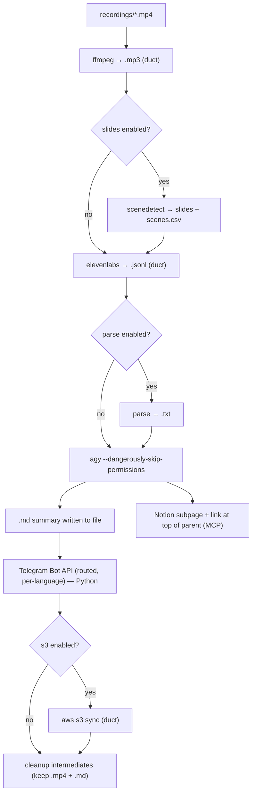

# Spec: Transcriber Engine

Derived from `docs/seed/transcriber-engine.md` and the brainstorm `docs/brainstorms/EXTRACTION_REPORT.md`.

## Problem Statement

Two ad-hoc, agent-driven meeting-transcription setups exist today — `../../scartill/scartill-ai-hub` and `../../adsight/ai-hub` — that share one pipeline but differ in customizations. Extract the shared core into this `transcriber` app as a **Python-native engine** attachable to each host repo as a **git submodule**. Each host supplies only its config, secrets (env vars), and `recordings/`. Preserve each host's customizations through config.

An earlier idea of "pure PowerShell scripts" is explicitly dropped in favor of Python.

## Requirements

R1. A single Python entry point processes new `*.mp4` files in a `recordings/` directory through the pipeline below.
R2. Stages: (1) audio extract, (2) optional slide/scene extraction, (3) transcribe, (4) optional transcript parse, (5) summarize, (6) publish & disseminate.
R3. Every stage is idempotent: skip work whose output already exists; only new recordings are processed.
R4. Stack: Python managed by `uv`; `duct` for child processes (ffmpeg, scenedetect, elevenlabs, aws). No PowerShell.
R5. Packaging: git submodule. The engine ships here; host repos add config + secrets + recordings.
R6. Orchestration: the Python engine is the top-level orchestrator; it runs deterministic stages, then calls a headless agent per new recording.
R7. Agent = Antigravity CLI (`agy`), invoked with `--dangerously-skip-permissions`. The agent's console output is **not** consumed — the agent is instructed to write results to a file, which Python then reads.
R8. Responsibility split:
   - **Agent (agy):** summarize (write `.md`) **and** publish to Notion via its `notion-*` MCP.
   - **Python:** deterministic media stages, Telegram dissemination (Bot HTTP API), S3 sync, cleanup, and per-recording stage status tracking (`.transcriber_state.json`).
R9. Config in JSON **or** YAML (`transcriber.config.json` / `.yaml` / `.yml`), format chosen by extension. Declares stage toggles and per-stage settings. Secrets referenced by env-var name only, never stored.
R10. Notion (both hosts): create a subpage under the configured parent page, then add its link at the **top** of the parent page.
R11. Telegram: topic→chat routing table with default-chat fallback; message language English or original per config.
R12. Cleanup: on a recording's success, S3 upload first (if enabled), then delete intermediates (`.mp3`, `.jsonl`, `.txt`, extracted slides, scenes CSV); keep `.mp4` and `.md`. A `--keep-intermediates` flag disables deletion.
R13. Per-recording failure isolation: one recording's failure must not abort the batch; cleanup runs only on that recording's success.
R14. Per-recording stage status tracking via a `.transcriber_state.json` manifest, so retries resume cleanly and do not create duplicate Notion pages / Telegram messages or skip an incomplete publish. Stage completion is tracked per publishing target (summarize, notion, telegram, s3), not inferred from artifact file existence alone.
R15. Pre-flight validation at startup: verify required CLI binaries (`ffmpeg`, `scenedetect`, `elevenlabs`, `aws`, `agy`) on `PATH` and required env vars (per enabled stages) are set; fail fast with a clear message. Also exposed as a `transcriber check` subcommand.
R16. All child-process invocations (`duct`) have configurable execution timeouts so malformed media or hung network sockets cannot block the orchestrator indefinitely.
R17. A `--dry-run` flag previews the execution plan (which `*.mp4` will be processed, which stages will run, publishing destinations) without invoking subprocesses, calling the agent, publishing, or deleting files.
R18. Transcript content passed to `agy` is wrapped using strict **non-XML** structural encapsulation (Markdown code fences / block quotes) in prompt templates, to reduce the prompt-injection surface created by `--dangerously-skip-permissions`.

## Background (source audit)

- **`scartill-ai-hub/scripts/Transcribe.ps1`** — fullest deterministic pipeline: `ffmpeg -vn -c:a libmp3lame -q:a 2` mp4→mp3; `scenedetect -b pyav ... detect-content --threshold 30 --min-scene-len 5s list-scenes -f <name>.scenes.csv save-images -n 1` → `extracted_slides.<name>/`; `elevenlabs speech-to-text convert --file <mp3> --model-id scribe_v2 --format jsonl` → `.jsonl`; then `parse_transcript.py` → `.txt`. Each step guarded by `Test-Path` on its output.
- **`adsight/ai-hub/scripts/Transcribe.ps1`** — same minus slide extraction and parse. **`Sync-ToCloud.ps1`**: `aws --profile ai-hub s3 sync ../recordings s3://ai-hub.adsight/recordings/`.
- **`scartill-ai-hub/scripts/parse_transcript.py`** — reads jsonl `word`/`spacing` items, emits `[MM:SS]` markers at a configurable interval (default 15s). Port verbatim into a module.
- **`slide-extractor.md`** — per-slide prompt: Notion markdown, mermaid for diagrams, `== no information ==` guard for empty slides.
- **`local-automation.md`** (both) — summary sections (Decisions, Action Items, Plans, Identified Risks); English-forced (scartill) vs original-language topic-routed Telegram (adsight); Notion targets and IDs.
- Divergences that become config: slide/parse/s3 toggles, Notion parent/server, Telegram routing + language, S3 bucket/profile.

## Proposed Solution

Python package `transcriber/` (uv-managed). The orchestrator discovers new recordings, runs deterministic stages via `duct`, then per recording invokes `agy` via `agy-headless-bridge` (`--dangerously-skip-permissions`, `add_dirs=[recording_dir]`) to write the summary `.md` and create/link the Notion subpage through its MCP. Python then sends Telegram messages via the Bot HTTP API, syncs to S3 if enabled, and cleans up intermediates on success.



### Config model (dataclasses)

```
Config
  recordings_dir: str
  stages: { slides: bool, parse_transcript: bool, s3_sync: bool }
  transcribe: { model_id: str }
  summary: { language: "en"|"original", sections: list[str] }
  agent: { cli: str, extra_args: list[str], output_file: str }   # output_file templated with {basename}
  notion: { server: str, parent_page_id: str, insert: "subpage" }
  telegram: { bot_token_env: str, default_chat_id: str, routing: dict[str,str] }
  s3: { bucket: str, profile: str } | None
  timeouts: { ffmpeg: int, scenedetect: int, elevenlabs: int, agy: int, s3: int }   # seconds; per-child-process (E3)
```

### Package layout

```
transcriber/
  __main__.py        # CLI entry + orchestrator
  config.py          # JSON/YAML loader → validated model
  pipeline.py        # ffmpeg / scenedetect / elevenlabs via duct
  parse.py           # ported parse_transcript logic
  agent.py           # agy invocation + file readback (summarize + Notion)
  publish/
    telegram.py      # Telegram Bot HTTP API (httpx)
    s3.py            # aws s3 sync via duct
  cleanup.py         # intermediate deletion
  prompt_templates/  # summary + slide-extractor prompts
examples/
  scartill.config.yaml
  adsight.config.yaml
```

## Task Breakdown

### Task 1 — Project scaffold + config loader (JSON/YAML)
- **Objective:** `pyproject.toml` (uv), package `transcriber/`, deps `duct`, `agy-headless-bridge`, `scenedetect`, `av`, `PyYAML`, `httpx`; dev `pytest`. `config.py` loads `.json`/`.yaml`/`.yml` by extension into a validated dataclass model; secrets resolved from env-var names at use time.
- **Guidance:** single loader dispatching on suffix; both formats map to the identical model.
- **Tests:** JSON and YAML fixtures parse to the identical model; missing required field → clear error; unknown/absent env var → readable error.
- **Demo:** `uv run python -c "from transcriber.config import load; print(load('examples/scartill.config.yaml'))"`.

### Task 2 — Deterministic media pipeline (`pipeline.py`)
- **Objective:** Port `Transcribe.ps1` to `duct`: mp4→mp3 (ffmpeg flags as in source), optional scenedetect (slides + scenes CSV), elevenlabs jsonl. Idempotent per-artifact guards. Wrap every child-process call with a **configurable execution timeout** (E3) so bad media or hung sockets cannot block indefinitely. Return per-recording result listing new artifacts.
- **Guidance:** mirror the exact ffmpeg/scenedetect/elevenlabs args from the source scripts; timeouts come from config with sensible defaults.
- **Tests:** duct mocked — assert command lines/args per toggle; existing-artifact skip; new-recording detection; timeout is passed through / enforced.
- **Demo:** run on a fixture `.mp4` (or mocked binaries) → artifacts appear; re-run is a no-op.

### Task 3 — Transcript parser module (`parse.py`)
- **Objective:** Port `parse_transcript.py` into an importable function (interval-based `[MM:SS]` markers) called from the pipeline; no `uv run` shell-out.
- **Tests:** golden-file jsonl→txt; empty/malformed lines skipped; interval boundary correct.
- **Demo:** parse sample `.jsonl` and diff against golden `.txt`.

### Task 4 — Agent stage (`agent.py`): summarize + Notion via agy
- **Objective:** Build prompt from `.txt`/`.jsonl` + slide images + `prompt_templates/` (port `slide-extractor.md` + summary sections). Wrap transcript content using **non-XML** structural encapsulation (Markdown code fences / block quotes) — never XML tags — to bound the prompt-injection surface. Invoke `agy` via `agy_headless_bridge.run(prompt, add_dirs=[recording_dir], extra_args=["--dangerously-skip-permissions"], ...)`, instructing it to (a) write the summary to the configured `output_file` and (b) create a Notion subpage under the configured parent via MCP and add the subpage link at the **top** of the parent. Read the file back; assert exists + non-empty; handle `AgyTimeoutError.partial`.
- **Tests:** prompt-builder units (language forced per config; slide sections only when slides exist; sections from config; **transcript wrapped in Markdown code fences, no XML**); agy call mocked to write a fixture file → assert readback + non-empty validation + timeout handling.
- **Demo:** with mocked/real agy, a `.txt` produces `<name>.md`.

### Task 5 — Telegram dissemination (`publish/telegram.py`)
- **Objective:** Send via `https://api.telegram.org/bot<token>/sendMessage` (token from env var named in config) using `httpx`. Topic→chat routing with default fallback; language per config; chunk messages to Telegram's length limit.
- **Tests:** routing resolves topics incl. default fallback; long-message split; HTTP client mocked to assert payloads; missing token env → clear error.
- **Demo:** mocked run shows correct `sendMessage` calls for a multi-topic summary.

### Task 6 — S3 sync (`publish/s3.py`) + cleanup (`cleanup.py`)
- **Objective:** `aws s3 sync <bucket>` with `--profile` from config via `duct` (with a configurable timeout, E3), gated on `s3_sync`. Cleanup deletes intermediates (`.mp3`, `.jsonl`, `.txt`, `extracted_slides.*`, `*.scenes.csv`); keeps `.mp4` + `.md`; runs only after successful publish + optional sync; `--keep-intermediates` skips it.
- **Tests:** sync command correct + skipped when disabled; cleanup deletes exactly the intermediate set and preserves `.mp4`/`.md`; no cleanup on failure or with `--keep-intermediates`; sync-before-delete ordering enforced.
- **Demo:** a dir with all artifacts → after run only `.mp4` + `.md` remain (all remain with `--keep-intermediates`).

### Task 7 — Orchestrator, CLI entry & pre-flight check (`__main__.py`)
- **Objective:** `uv run transcriber [--config PATH] [--keep-intermediates] [--dry-run]` plus a `transcriber check` subcommand:
  1. **Pre-flight check (E2):** verify required binaries (`ffmpeg`, `scenedetect`, `elevenlabs`, `aws`, `agy`) on `PATH` and required env vars (per enabled stages) are set; fail fast with a clear message. Also runnable standalone as `transcriber check`.
  2. Run child commands via `duct` with **configurable execution timeouts (E3)**.
  3. **`--dry-run` (P1):** load config, discover new `*.mp4`, print the execution plan (recordings, stages, publishing destinations), then exit without invoking subprocesses, the agent, publishing, or deletion.
  4. Batch execution: load config → discover new `*.mp4` → pipeline → agent → Telegram → S3 + cleanup, per recording, with structured logging, **per-recording `.transcriber_state.json` stage-status tracking for resumeability (E1)**, and per-recording failure isolation (cleanup only on that recording's success). On retry, completed stages (summarize/notion/telegram/s3) are skipped per the manifest to avoid duplicate Notion pages / Telegram messages.
  5. Emit a batch run summary (per-recording outcome; e.g. "2 succeeded, 1 failed at audio-extract").
- **Tests:** pre-flight failure on missing binary/env var; timeout enforcement; dry-run prints plan and performs no side effects; E2E with externals mocked — happy path over 2 fixtures; a failing stage on one recording skips its cleanup but processes the other; state manifest causes completed stages to be skipped on re-run; disabled toggles skip stages.
- **Demo:** `uv run transcriber --config examples/adsight.config.yaml --dry-run` prints the plan; a full run over fixtures reports per-recording results.

### Task 8 — Submodule packaging, example configs, docs
- **Objective:** Example configs for both hosts reflecting real behavior (both: slides on, subpage + link-on-top; scartill: parse on, single English chat; adsight: s3 on, topic-routed original-language). Rewrite `README.md` (engine overview, config schema, prerequisites, submodule adoption). Supersede the old `extraction-brainstorm.md` seed.
- **Tests:** both example configs load under Task 1's loader.
- **Demo:** `uv run transcriber --config examples/adsight.config.yaml` loads cleanly; README documents adoption.

## Risks

- **1=b tradeoff:** Notion publishing is agent-driven (via agy MCP), so it is not fully deterministic/testable; real Notion writes are verifiable only via live-agy demo. Tests mock the agy call.
- **agy non-TTY bug (#76) / approval stalls:** mitigated by file-output convention + `--dangerously-skip-permissions` + `agy-headless-bridge` pty + idle timeout.
- **`--dangerously-skip-permissions`** grants agy unattended tool/shell access — acceptable for local single-user use; flag before any shared-CI use.
- **Windows-first:** POSIX pty path in the bridge is unverified upstream; target Windows initially.
