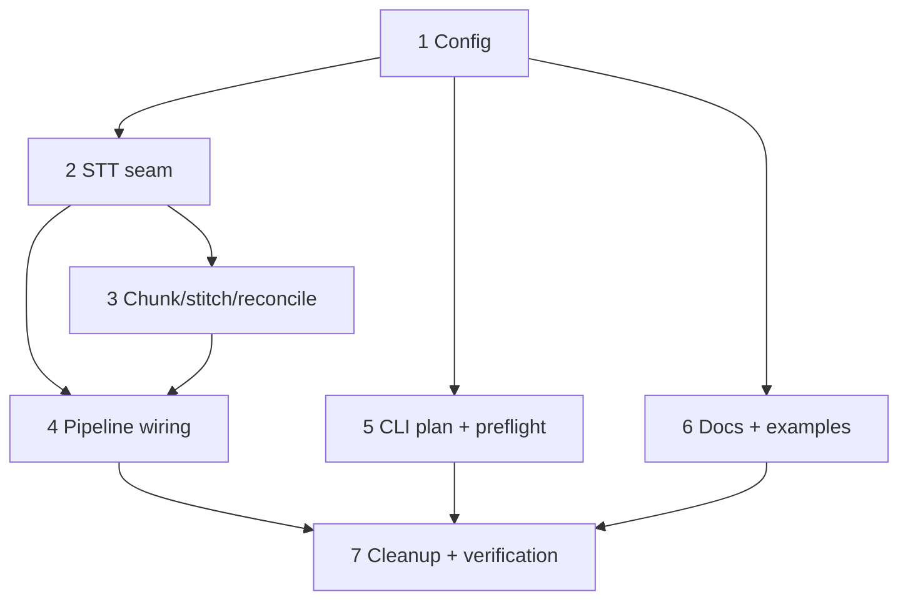

# Task Summary & Orchestration Guide — Replace ElevenLabs with OpenRouter diarized STT

**Spec:** `docs/specs/openrouter-transcription.md`
**Critique applied:** `docs/critiques/openrouter-transcription.md` (pass 1 — all
findings incorporated: E1/P1/E2 must-address + P2/P3/E3/E4/E5).

Replace the ElevenLabs CLI transcription with OpenRouter's `/audio/transcriptions`
endpoint: diarized, chunked (explicit time-sliced ffmpeg), stitched with a global
speaker registry, idempotent per-segment, `openrouter` now always required.

## Tasks

| # | Task | File | Depends on |
|---|------|------|-----------|
| 1 | Config: `transcribe.*`, mandatory `openrouter`, `timeouts.transcribe` | `task-1-config.md` | none |
| 2 | OpenRouter STT seam `_openrouter_transcribe` + `TranscribeError` | `task-2-openrouter-stt-seam.md` | 1 |
| 3 | Chunker + stitcher + speaker reconciliation | `task-3-chunker-stitcher-reconcile.md` | 1, 2 |
| 4 | Pipeline wiring + per-segment idempotency | `task-4-pipeline-wiring-idempotency.md` | 1, 2, 3 |
| 5 | CLI plan + preflight (`--dry-run` / `check`) | `task-5-cli-plan-preflight.md` | 1 |
| 6 | Docs & examples | `task-6-docs-and-examples.md` | 1 |
| 7 | Cleanup remnants + segment temp files + full verification | `task-7-cleanup-and-verification.md` | 1–6 |

## Dependency graph

## Execution waves (parallelization)

- **Wave 0 (foundation):** Task 1 alone — every module imports the config model.
- **Wave 1 (parallel):** Task 2, Task 5, Task 6 can all start once Task 1 lands.
  (Task 6 docs can be drafted early but finalize after Task 1's field set is
  frozen.)
- **Wave 2:** Task 3 (needs Task 2's `TranscriptChunk`).
- **Wave 3 (integration):** Task 4 (needs 2 + 3).
- **Wave 4 (finalize):** Task 7 — cleanup edits need Task 4's work-dir shape;
  full `pytest` runs last after 1–6.

## Ownership / no-collision map (files each task may edit)

- **T1:** `config.py`, `tests/test_config.py`
- **T2:** `backends/transcribe_openrouter.py` (seam), `backends/errors.py`,
  `tests/test_transcribe.py`
- **T3:** `backends/transcribe_openrouter.py` (chunk/stitch/reconcile),
  `tests/test_transcribe.py`
- **T4:** `backends/transcribe_openrouter.py` (`transcribe_recording`),
  `pipeline.py`, `tests/test_pipeline.py`
- **T5:** `__main__.py`, `tests/test_main.py`
- **T6:** `README.md`, `examples/*.config.yaml`, `tests/test_examples.py`
- **T7:** `cleanup.py`, `tests/test_cleanup.py`

**Shared file to coordinate:** `backends/transcribe_openrouter.py` is touched by
T2 (seam), T3 (chunk/stitch/reconcile), and T4 (`transcribe_recording`). Agree the
function boundaries up front: T2 owns the single-file HTTP call + parsing/data
types; T3 owns the pure chunk/stitch/reconcile helpers; T4 owns the orchestration
entry that composes them + the manifest. `_ALWAYS_BINARIES` edit lives in T5
(T7 only verifies it was removed).

## Global invariants (apply to every task)

- **`openrouter` is now always required** — there is no OpenRouter-less run.
- **Secrets by env-var name only**, resolved at use time; never log the API key,
  request headers, or base64 audio bytes (R3).
- **No silent fallback** — a non-diarizing model's `400` fails the stage with
  `TranscribeError` (R10).
- **Manifest-gated idempotency** — retries never re-pay for a completed segment;
  a `segment_seconds`/`overlap_seconds` change invalidates the manifest (E5).
- **ffmpeg has no segment overlap** — chunking is explicit per-part `-ss/-t`
  slices (E1); never `-f segment`.
- **Diarized output** is `Speaker <ID>: <text>` lines, no timestamps (R2/P2);
  `diarize=false` or no labels → flat text (R5).
- **`.txt` is a durable KEEP output**; `transcribe_work.{name}/` is an
  intermediate cleaned up unless `--keep-intermediates`.
- Windows-first; all paths `pathlib.Path`.

## Definition of done

All seven task checkboxes marked `[x]`; `uv run pytest -q` green; a slides-off,
`agy`-summarize config transcribes a multi-segment recording into a diarized,
speaker-attributed `<name>.txt` via OpenRouter with aggregate `usage.cost` logged,
and the ElevenLabs CLI is no longer referenced anywhere in engine code.
