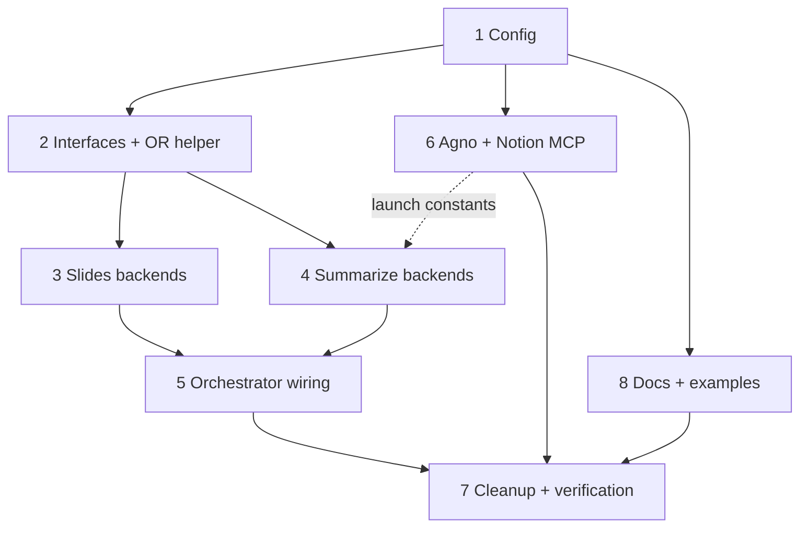

# Task Summary & Orchestration Guide — Slide Description + Summarize Backends

**Spec:** `docs/specs/slide-description-openrouter.md`

Split the post-transcript work into two independently-configurable stages —
`describe_slides` (backend: `agy` | `openrouter`) and `summarize` (backend:
`agy` | `agno`, Notion always via MCP) — plus config, orchestration, cleanup, and
docs. All resolved decisions: D1 (Notion via MCP; summarize is `agy`/`agno`),
D2 (no legacy `stages.slides` bool), D3 (ship all valid combinations).

## Tasks

| # | Task | File | Depends on |
|---|------|------|-----------|
| 1 | Config: backends, `openrouter`, `notion.token_env`, timeouts | `task-1-config.md` | none |
| 2 | Backend interfaces + OpenRouter vision helper | `task-2-backend-interfaces-and-openrouter-helper.md` | 1 |
| 3 | Slides backends (agy + openrouter) + slide-input helper | `task-3-slides-backends.md` | 1, 2 |
| 4 | Summarize backends (agy + agno) | `task-4-summarize-backends.md` | 1, 2 (+ 6 constants) |
| 5 | Orchestrator wiring (`__main__` + `state`) | `task-5-orchestrator-wiring.md` | 1, 3, 4 |
| 6 | Agno dependency + Notion MCP wiring | `task-6-agno-and-notion-mcp.md` | 1 (feeds 4) |
| 7 | Cleanup + full verification | `task-7-cleanup-and-verification.md` | 1–6 (verify); cleanup only needs 3 |
| 8 | Docs: README + examples | `task-8-docs-readme-and-examples.md` | 1 |

## Dependency graph

## Execution waves (parallelization)

- **Wave 0 (foundation):** Task 1 alone. Everything imports the config model.
- **Wave 1 (parallel):** Task 2, Task 6, Task 8 can all start once Task 1 lands.
  (Task 8 docs can be drafted early but should be finalized after Task 1's field
  set is frozen.)
- **Wave 2 (parallel):** Task 3 and Task 4 (both need Task 2; Task 4 also
  consumes Task 6's Notion-MCP launch constants — land Task 6 before Task 4's
  agno path is finished).
- **Wave 3 (integration):** Task 5 (needs 3 + 4).
- **Wave 4 (finalize):** Task 7 (cleanup can proceed after Task 3; full
  verification/parity runs last, after 1–6 and 8).

## Ownership / no-collision map (files each task may edit)

- **T1:** `config.py`, `tests/test_config.py`
- **T2:** `backends/__init__.py`, `backends/interfaces`, OpenRouter helper,
  `tests/test_backends.py` (+ shared error types)
- **T3:** `backends/slides.py` (+ slide-input helper), `tests/test_slides.py`;
  may make the minimal `pipeline._extract_slides` `-f`-path edit (note for T7)
- **T4:** `agent.py` (`_slide_block` refactor), `backends/summarize.py` (+ agno
  module), `tests/test_agent.py`
- **T5:** `state.py`, `__main__.py`, `tests/test_main.py`
- **T6:** `pyproject.toml` (`agno` extra + pin), Notion-MCP launch constants
- **T7:** `cleanup.py`, `tests/test_cleanup.py`
- **T8:** `README.md`, `examples/*.yaml`, `tests/test_examples.py`

Potential contention points to coordinate:
- `pipeline._extract_slides` `-f` path — T3 (set absolute path) and T7 (fix the
  cleanup candidate) touch the same scenes-CSV concern. Agree the resolved CSV
  location once: `extracted_slides.<name>/<name>.scenes.csv`.
- `backends/summarize.py` MCP close vs. Task 6 launch — T4 owns the run wrapper /
  `finally`-close; T6 owns the launch constants/env-merge. Define the interface
  boundary (a `notion_mcp_tools(config) -> MCPTools` factory) so they don't edit
  each other's code.

## Global invariants (apply to every task)

- **Backends default to `agy`** → no config change reproduces today's behavior.
- **Secrets by env-var name only**, resolved at use time; never log the
  OpenRouter key, Notion token, auth headers, or base64 image bytes.
- **Notion always via MCP** for summarize; no hand-rolled REST client.
- **No silent cross-backend fallback**; a valid empty slide result is not a
  failure.
- **Pipeline stays network-free**; paid calls live in manifest-gated orchestrator
  steps (T5) so retries don't re-issue them.
- Windows-first: the Notion MCP `npx` spawn (T6) is the riskiest new runtime path
  — smoke-test it on Windows before the T7 parity run.

## Definition of done

All eight task checkboxes marked `[x]`; `uv run pytest -q` green; the manual
parity check (T7) meets the ≥40% wall-time bar with no visible quality regression
and a working Notion publish via both summarize backends.
