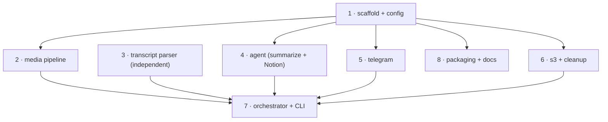

# Task Set Summary — Transcriber Engine

**Spec:** `docs/specs/transcriber-engine.md`
**Tasks directory:** `docs/tasks/transcriber-engine/`

This spec is split into 8 standalone task files. Each has a `[ ]` completion mark; mark it `[x]` when its observable acceptance passes.

## Tasks

| # | File | Owns | Depends on |
|---|------|------|-----------|
| 1 | `task-1-scaffold-and-config.md` | `pyproject.toml`, `transcriber/config.py` | — (foundation) |
| 2 | `task-2-media-pipeline.md` | `transcriber/pipeline.py` | 1 |
| 3 | `task-3-transcript-parser.md` | `transcriber/parse.py` | — (self-contained) |
| 4 | `task-4-agent-summarize-notion.md` | `transcriber/agent.py`, `prompt_templates/` | 1 |
| 5 | `task-5-telegram.md` | `transcriber/publish/telegram.py` | 1 |
| 6 | `task-6-s3-and-cleanup.md` | `transcriber/publish/s3.py`, `transcriber/cleanup.py` | 1 |
| 7 | `task-7-orchestrator-cli.md` | `transcriber/__main__.py`, state helper | 1–6 (integration) |
| 8 | `task-8-packaging-and-docs.md` | `examples/*.yaml`, `README.md`, old seed | 1 |

## Dependency graph

## Parallel execution guidance

- **Wave 0 (start immediately, in parallel):** Task 1 and Task 3. Task 3 is fully independent; Task 1 is the foundation everyone else imports.
- **Wave 1 (after Task 1 lands, all parallel):** Tasks 2, 4, 5, 6, 8. They own disjoint files and only share the config model from Task 1.
  - **Coordination note:** Tasks 5 and 6 both add to `transcriber/publish/__init__.py`. Keep edits additive; whoever creates the package first commits an empty/minimal `__init__.py` and the other appends.
- **Wave 2 (integration, after 2–6):** Task 7 wires the pipeline → agent → telegram → s3/cleanup with the `.transcriber_state.json` manifest and failure isolation. Task 8's example-config load test also benefits from Task 7's CLI for the `--dry-run` demo.

## Cross-cutting invariants (apply to all tasks)

- **Secrets by env-var name only** — never store token/credential values in config or code.
- **Timeouts (E3):** every child-process call (`duct`) takes a configurable timeout from `config.timeouts`.
- **State manifest (E1):** stage completion is tracked per publishing target in `.transcriber_state.json`, not inferred from artifact existence alone (Task 7 owns it; other tasks expose clear success/failure signals).
- **Cleanup safety:** never delete `.mp4` or `.md`; cleanup only on success and after S3 (if enabled); `--keep-intermediates` disables it.
- **Non-XML prompt encapsulation (X2):** transcript content wrapped in Markdown code fences / block quotes, never XML tags.
- **Windows-first:** target Windows; note the unverified POSIX pty path in `agy-headless-bridge`.

## Testing

Each task ships `pytest` unit tests mocking its externals (`duct`, `httpx`, `agy`). Task 7 provides the mocked end-to-end test. Do not require live `ffmpeg`/`elevenlabs`/`agy`/AWS/Notion/Telegram for the test suite to pass; live behavior is verified via each task's demo.
