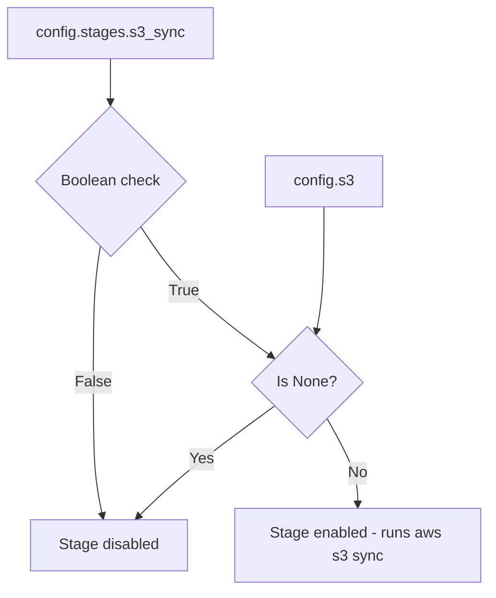

# S3 Sync Integration

<!-- openwiki: broken internal link [publish/s3.py] file "publish/s3.py" does not exist. Fix the href or restore the target, then delete this comment. -->
The S3 sync stage is a manifest-gated publishing step in the transcriber orchestrator that uploads a completed recording directory to an Amazon S3 bucket using the AWS CLI. It is implemented in [`transcriber/publish/s3.py`](publish/s3.py) and invoked from the orchestrator's `_process_one` loop after Telegram and before cleanup.

The stage is deliberately *gated*: it is a no-op when the S3 toggle is off or when no S3 target is configured, making it safe to leave enabled-but-unconfigured in shared config files without spawning AWS calls.

## Config model

S3 is configured in two layers that must both be satisfied for the stage to run:

<!-- openwiki: broken internal link [config.py] file "config.py" does not exist. Fix the href or restore the target, then delete this comment. -->
- **`config.s3`** — an optional `S3` dataclass (`bucket`, `profile`) at the top level of [`transcriber/config.py`](config.py). When absent the field is `None`.
- **`config.stages.s3_sync`** — a `bool` on the `Stages` dataclass controlling the run toggle.

<!-- openwiki: broken internal link [config.py] file "config.py" does not exist. Fix the href or restore the target, then delete this comment. -->
The loader in [`transcriber/config.py`](config.py) treats `s3` as optional: it is built from `data.get("s3")` when present, otherwise left as `None` (see `_from_dict`). The `s3_sync` toggle is required under `stages` and must be a boolean.



**Caption:** Two-layer gating for the S3 sync stage — both the `stages.s3_sync` toggle and a non-None `config.s3` are required for the stage to run.

## Gating logic

<!-- openwiki: broken internal link [publish/s3.py#L63-L69] file "publish/s3.py" does not exist. Fix the href or restore the target, then delete this comment. -->
The stage's gate is expressed by [`is_enabled`](publish/s3.py#L63-L69):

```python
def is_enabled(config: Config) -> bool:
    return bool(config.stages.s3_sync) and config.s3 is not None
```

<!-- openwiki: broken internal link [transcriber/__main__.py] file "transcriber/__main__.py" does not exist. Fix the href or restore the target, then delete this comment. -->
The orchestrator checks this gate twice — once at plan time in `_enabled_stage_names` (which only appends `"s3-sync"` to the dry-run stage list when the gate is open) and once at run time in `_process_one` (lines 401-408 of [`transcriber/__main__.py`](transcriber/__main__.py)). The run-time path also honors the per-recording state manifest: if `"s3"` is already marked complete, the stage is skipped.

## Execution

<!-- openwiki: broken internal link [publish/s3.py#L72-L113] file "publish/s3.py" does not exist. Fix the href or restore the target, then delete this comment. -->
When enabled, the stage runs [`sync`](publish/s3.py#L72-L113), which:

<!-- openwiki: broken internal link [publish/s3.py#L44-L60] file "publish/s3.py" does not exist. Fix the href or restore the target, then delete this comment. -->
1. Builds the command vector via [`build_sync_command`](publish/s3.py#L44-L60):
   ```
   aws s3 sync <local_dir> <config.s3.bucket> --profile <config.s3.profile>
   ```
<!-- openwiki: broken internal link [publish/s3.py#L28] file "publish/s3.py" does not exist. Fix the href or restore the target, then delete this comment. -->
2. Executes it as a child process through the [`duct`](publish/s3.py#L28) library.
3. Polls the child process every `_POLL_INTERVAL_SECONDS` (0.1s), enforcing `config.timeouts.s3` as a wall-clock deadline using `time.monotonic()`.
4. Returns `True` on success, raises `S3SyncTimeout` if the deadline passes (after killing the process), or raises `S3SyncError` on any non-zero exit.

`build_sync_command` raises `ValueError` if `config.s3` is `None` — the caller is expected to gate on `is_enabled` before calling it.

## Pre-flight requirement

<!-- openwiki: broken internal link [transcriber/__main__.py] file "transcriber/__main__.py" does not exist. Fix the href or restore the target, then delete this comment. -->
Because S3 sync is a real child process, the pre-flight check in [`transcriber/__main__.py`](transcriber/__main__.py) requires the `aws` binary on `PATH` whenever the S3 stage is enabled. `_required_binaries` (lines 95-105) appends `"aws"` when `s3_mod.is_enabled(config)` is true, and `preflight_check` reports a missing `aws` as a problem before any work starts.

This means that enabling S3 in config has a concrete operational footprint: a host without the AWS CLI installed (or without a suitable `aws` on `PATH`) will fail `transcriber check` and will not run a batch until the requirement is satisfied.

## Manifest-gated idempotency

The S3 stage is tracked in the per-recording state manifest (`<name>.transcriber_state.json`) under the key `"s3"`. The canonical stage order is:

1. `pipeline`
2. `describe_slides`
3. `summarize`
4. `notion`
5. `telegram`
6. **`s3`**
7. `cleanup`

On a successful `sync` the orchestrator calls `state.mark_complete("s3")`, making the upload idempotent on retry. On a run where S3 is disabled (toggle off or no `config.s3`), the stage logs "disabled, skipping" and does not mark `"s3"` complete — but because cleanup also checks the manifest, a disabled S3 stage does not block cleanup on a later run where S3 is enabled. (The manifest entry for `s3` is simply absent, which is treated as incomplete, so re-enabling S3 re-runs the sync exactly once.)

## Ordering contract

<!-- openwiki: broken internal link [publish/s3.py] file "publish/s3.py" does not exist. Fix the href or restore the target, then delete this comment. -->
<!-- openwiki: broken internal link [transcriber/__main__.py] file "transcriber/__main__.py" does not exist. Fix the href or restore the target, then delete this comment. -->
The module documentation states an explicit ordering contract (requirement R12): a successful `sync` MUST complete before any cleanup/deletion of intermediates. [`transcriber/publish/s3.py`](publish/s3.py) only performs the upload; `transcriber.cleanup` is a separate function the orchestrator calls *after* `sync` returns `True`, or after the stage is skipped on a run where S3 is disabled. The orchestrator enforces this by sequencing the S3 stage before the cleanup stage in `_process_one` (lines 399-419 of [`transcriber/__main__.py`](transcriber/__main__.py)).

## Error semantics

- **`S3SyncError`** — raised when the `aws s3 sync` child process exits non-zero, or when `duct` surfaces a `StatusError`.
- **`S3SyncTimeout`** — a subclass of `S3SyncError`, raised when the upload exceeds `config.timeouts.s3` seconds; the child process is killed before the exception is raised.

Both exceptions propagate to the orchestrator's failure-isolation handler, which records the failing stage as `"s3"` in the recording's outcome and continues the batch.

## Configuration example

A minimal S3-enabled config snippet (the `s3` section and the `stages.s3_sync` toggle):

```yaml
stages:
  slides:
    enabled: true
    backend: openrouter
  s3_sync: true

s3:
  bucket: s3://my-bucket/recordings/
  profile: acme

timeouts:
  s3: 900
```

Without `s3_sync: true`, the stage is skipped regardless of whether `s3` is configured. Without the `s3` block, `config.s3` is `None` and the stage is skipped even when `s3_sync` is true.

## Testing

<!-- openwiki: broken internal link [tests/test_s3.py] file "tests/test_s3.py" does not exist. Fix the href or restore the target, then delete this comment. -->
The test suite in [`tests/test_s3.py`](tests/test_s3.py) mocks `duct` entirely — no real `aws` process is spawned. Key behaviors covered:

- **Command shape:** `build_sync_command` and `sync` both produce `["aws", "s3", "sync", <local_dir>, <bucket>, "--profile", <profile>]`.
- **Gating:** `sync` returns `False` without spawning a child process when the toggle is off or `config.s3` is `None`; `is_enabled` is verified across the full true/false matrix.
- **Failure:** a non-zero exit raises `S3SyncError`.
- **Timeout:** a process that never completes triggers `S3SyncTimeout` after the deadline, and the handle is killed and waited.

## Related pages

- [OSS Companion Transcriber Engine](../architecture/oss-companion-transcriber.md) — orchestrator, manifest-gated stages, and the full execution sequence including S3.
