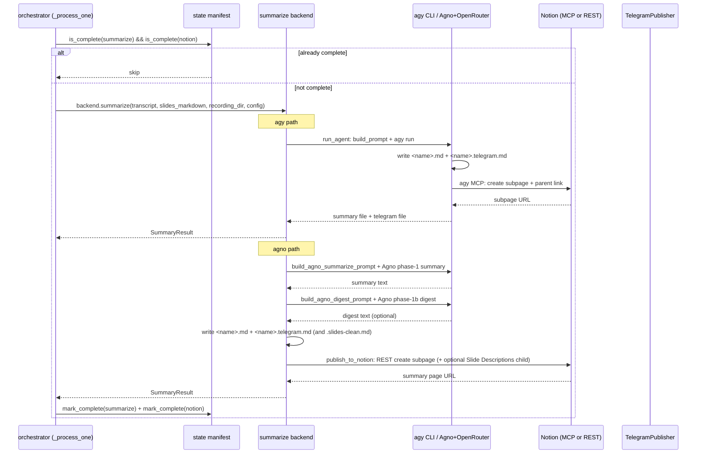

# Summarize and Publish Workflow

The `summarize` stage is the manifest-gated post-transcript step that turns the transcript (and, when present, the prepared slide markdown) into a meeting summary, an optional Telegram digest, and a Notion subpage. It is the only stage whose backend is selectable between **agy** (default) and **agno**, and the Notion publish path is **backend-specific**: agy publishes via its own Notion MCP as part of its run, while agno publishes directly via the Notion REST API with no MCP and no model tool-calling.

`summarize` and `notion` are treated as one manifest-coupled stage pair: the orchestrator marks both `summarize` and `notion` complete in the same step, and a Notion failure fails the whole pair.

**Related pages:** [OSS Companion Transcriber Engine](../architecture/oss-companion-transcriber.md), [Backend Selection and Interfaces](../concepts/backend-selection.md), [Notion Integration](../integrations/notion.md), [Telegram Integration](../integrations/telegram.md), [Slide Description Workflow](slides-description.md).

## Position in the pipeline

The transcriber runs stages in this order for each recording:

1. **pipeline** — ffmpeg audio extract, optional scenedetect slide extraction, OpenRouter STT transcription. Media-only; no slides or summarize backend calls.
2. **describe_slides** — (manifest-gated) the OpenRouter vision backend produces `<name>.slides.md` from the extracted JPEGs.
3. **summarize + notion** — consumes the transcript and, if present, the slide markdown; publishes to Notion.
4. **telegram** — sends the digest or full summary.
5. **s3** — optional S3 sync of intermediates.
6. **cleanup** — deletes intermediates on full success (unless kept).

The `summarize` stage separately selects `agy` (default) or `agno`. These two selections are orthogonal to the slides stage (`openrouter` only) and do not affect each other.

## Inputs: what the stage consumes

- **Transcript text** — the `<name>.txt` produced by the pipeline's transcribe stage, read by the orchestrator and handed to the backend as `transcript_path`.
- **Slide markdown** — the text of `<name>.slides.md` produced by `describe_slides`, read by the orchestrator and passed as `slides_markdown`. When slides are disabled, or when the file is absent/empty/whitespace, the orchestrator passes `None` and the backend treats it exactly like slides-off.
- **Recording directory** — the directory the backend uses to resolve output paths (both backends write `<name>.md` and `<name>.telegram.md` beside the transcript, inside the recording directory).
- **Config** — the loaded `Config`, including `summary.backend`, `summary.language`, `summary.sections`, `notion.*`, and the stage timeouts.

## The decision flow in the orchestrator

<!-- openwiki: broken internal link [/transcriber/__main__.py] link "/transcriber/__main__.py" is root-absolute, which no real consumer resolves against the repository root (not a coding agent reading the page, not GitHub's Markdown renderer, not a local viewer); use a path relative to this file instead. Fix the href or restore the target, then delete this comment. -->
The orchestrator (`_process_one` in [`/transcriber/__main__.py`](/transcriber/__main__.py)) decides whether to run the summarize backend. The decision has one skip path and one run path:

<!-- openwiki: mermaid parse failed and this diagram was converted to a text fence so it does not break rendering. Fix the diagram source and restore the mermaid fence. Parser error: Heuristic: an unescaped angle bracket inside a label breaks rendering; rephrase the label. -->
```text
flowchart TD
    StartEntry["Orchestrator: summarize + notion stage"] --> CheckManifest{"manifest.is_complete(summarize) AND is_complete(notion)?"}
    CheckManifest -->|true| SkipManifest["log: already complete, skip"]
    CheckManifest -->|false| ReadSlides{"slides enabled AND <name>.slides.md exists?"}
    ReadSlides -->|yes| LoadSlides["read <name>.slides.md as slides_markdown"]
    ReadSlides -->|no| NoneSlides["slides_markdown = None (slides-off)"]
    LoadSlides --> SelectBackend["backends_mod.get_summarize_backend(config)"]
    NoneSlides --> SelectBackend
    SelectBackend --> RunBackend["backend.summarize(transcript, slides_markdown, recording_dir, config)"]
    RunBackend --> MarkBoth["state.mark_complete(summarize) + state.mark_complete(notion)"]
    SkipManifest --> StageDone["stage done"]
    MarkBoth --> StageDone
```

**Caption:** The summarize+notion decision flow in the orchestrator. The stage is skipped only when both `summarize` and `notion` are already marked complete; otherwise the configured backend runs once and both manifest keys are marked together.

Both `summarize` and `notion` are marked complete in the same step. This is intentional: the Notion publish is part of the same backend run, so a crash after a successful Notion publish but before the manifest mark is recovered by the backend's own publish-record sidecar (agno) or by agy's MCP-side idempotency (agy), and a retry does not create a duplicate Notion page.

## Backend selection

<!-- openwiki: broken internal link [/transcriber/backends/summarize.py] link "/transcriber/backends/summarize.py" is root-absolute, which no real consumer resolves against the repository root (not a coding agent reading the page, not GitHub's Markdown renderer, not a local viewer); use a path relative to this file instead. Fix the href or restore the target, then delete this comment. -->
Selection is a pure function of `config.summary.backend`, implemented by [`/transcriber/backends/summarize.py`](/transcriber/backends/summarize.py)'s `get_summarize_backend`.

- **`summary.backend == "agy"`** → `AgySummarizeBackend()`. The base engine does not import `agno` on this path.
<!-- openwiki: broken internal link [/transcriber/backends/summarize_agno.py] link "/transcriber/backends/summarize_agno.py" is root-absolute, which no real consumer resolves against the repository root (not a coding agent reading the page, not GitHub's Markdown renderer, not a local viewer); use a path relative to this file instead. Fix the href or restore the target, then delete this comment. -->
- **`summary.backend == "agno"`** → lazily imports `AgnoSummarizeBackend` from [`/transcriber/backends/summarize_agno.py`](/transcriber/backends/summarize_agno.py) and returns it. The optional `agno` extra is only required when this backend is selected.
- An unknown value raises `ValueError` — there is **no silent cross-backend fallback**.

<!-- openwiki: broken internal link [/transcriber/backends/interfaces.py] link "/transcriber/backends/interfaces.py" is root-absolute, which no real consumer resolves against the repository root (not a coding agent reading the page, not GitHub's Markdown renderer, not a local viewer); use a path relative to this file instead. Fix the href or restore the target, then delete this comment. -->
The interface contract lives in [`/transcriber/backends/interfaces.py`](/transcriber/backends/interfaces.py)'s `SummarizeBackend` protocol: `summarize(transcript_path, slides_markdown, recording_dir, config) -> SummaryResult`.

## How slide markdown is fed to the summary

<!-- openwiki: broken internal link [/transcriber/agent.py] link "/transcriber/agent.py" is root-absolute, which no real consumer resolves against the repository root (not a coding agent reading the page, not GitHub's Markdown renderer, not a local viewer); use a path relative to this file instead. Fix the href or restore the target, then delete this comment. -->
The slide markdown is embedded in the summary prompt as **reference context only**. The relevant helpers live in [`/transcriber/agent.py`](/transcriber/agent.py):

- `_slide_block(slides_markdown)` — assembles the slide-description **reference** block from pre-computed slide markdown. It embeds the text wrapped in a **non-XML** Markdown code fence (produced by `_fence_for`, which guarantees a fence longer than any run of backticks in the embedded text) and instructs the model that the block is for cross-reference only, not to be reproduced.
- `build_prompt(...)` — assembles the agy prompt. When `slides_markdown` is `None`/empty/whitespace, `_slide_block` returns `""` and no slide block appears in the prompt at all (Spec R3).
- `append_slide_descriptions(summary_markdown, slides_markdown)` — deterministically appends the prepared slide markdown as a final `## Slide Descriptions` section on the engine side, so the slide content never consumes the summarizing model's bounded output budget.

The slide content is kept **out of the model's output budget** because routing a large slide block through the model just to echo it caused truncation that dropped the whole Slide Descriptions section before it was reached. Keeping slides out of the output removes that failure while still giving the model the slide content to cross-reference in the summary body.

The transcript itself is encapsulated in a Markdown code fence — never XML tags — so the prompt-injection surface is bounded. The fencer in `_fence_for` guarantees a fence longer than any run of backticks in the transcript, so a transcript that itself contains triple-backtick blocks cannot break out of its fence.

For the agno backend, `build_agno_summarize_prompt` inlines the transcript (the plain model call has no file-read tool and Agno sends the prompt over HTTP, so there is no CLI length limit). The agy backend uses `build_prompt` with `inline_transcript=False` so agy reads the transcript file by absolute path.

### Slide descriptions on the agy path vs the agno path

There is a split between the two backends for how slide descriptions reach Notion:

- **agy path:** agy publishes its own Notion page via its MCP from the prompt, which the engine does not control, so the Notion "Slide Descriptions" child page is **not** created on the agy path — only the local `<name>.slides-clean.md` is produced. The local file is written by `run_agent` → `_write_clean_slides_file` using `clean_slide_descriptions(slides_markdown)`.
- **agno path:** the engine writes `<name>.slides-clean.md` itself (in `AgnoSummarizeBackend.summarize`) and, when cleaned slide descriptions are non-empty, creates a "Slide Descriptions" child page **under the summary page** via the direct REST publish. Hosts needing the slides subpage use `summary.backend: agno`.

In both paths the raw `<name>.slides.md` (markers kept) remains the debug intermediate, and `<name>.slides-clean.md` (markers stripped) is the durable reader-facing slides output.

## The two summarize backends

### agy backend

<!-- openwiki: broken internal link [/transcriber/backends/summarize.py] link "/transcriber/backends/summarize.py" is root-absolute, which no real consumer resolves against the repository root (not a coding agent reading the page, not GitHub's Markdown renderer, not a local viewer); use a path relative to this file instead. Fix the href or restore the target, then delete this comment. -->
`AgySummarizeBackend` in [`/transcriber/backends/summarize.py`](/transcriber/backends/summarize.py) wraps `transcriber.agent.run_agent`. The agent:

- writes `<name>.md` (the summary file, which is the source of truth for the summary) and `<name>.telegram.md` (the digest),
- publishes to Notion via agy's own Notion MCP as instructed in the prompt,
- applies the non-empty `<name>.md` post-condition.

Behavior is unchanged from the pre-split engine. The engine reads the summary back from the file agy writes, not from agy's stdout.

### agno backend

<!-- openwiki: broken internal link [/transcriber/backends/summarize_agno.py] link "/transcriber/backends/summarize_agno.py" is root-absolute, which no real consumer resolves against the repository root (not a coding agent reading the page, not GitHub's Markdown renderer, not a local viewer); use a path relative to this file instead. Fix the href or restore the target, then delete this comment. -->
`AgnoSummarizeBackend` in [`/transcriber/backends/summarize_agno.py`](/transcriber/backends/summarize_agno.py) drives an Agno agent with a configurable OpenRouter model to produce the meeting summary and a short digest as **plain text**. The **engine** then:

- writes `<name>.md` and `<name>.telegram.md` from the model output,
- publishes the Notion subpage directly via the Notion REST API (`transcriber.backends.notion_publish.publish_to_notion`) — no MCP, no model tool-calling.

Design constraints:

- **Notion via the REST API.** The subpage is created by the engine through the Notion REST API, not by a model tool-call. The official Notion MCP's tool schemas (`oneOf`/`anyOf`/`$ref`) break tool-calling on Gemini/Mistral over OpenRouter (empty `null` completions, zero tool calls), so a deterministic engine-side publish is used instead.
- **Optional import.** `agno` and its OpenRouter model provider are imported lazily inside this module so the base engine never needs the `agno` extra unless this backend is selected. A missing import raises the actionable `AgnoImportError`.
- **Hard time bound (R22b/E2).** The async run is wrapped in `asyncio.run` under a timeout equal to the summarize-stage timeout (`timeouts.summarize` when set, else `timeouts.agy`). The blocking Notion publish runs in a worker thread so the timeout can still cancel the run.
- **Non-empty post-condition (R22).** After the run, the engine re-uses the same non-empty `<name>.md` success check as the agy path: an empty or absent summary file fails the stage (retryable).
- **Atomicity (R21).** Summarize + Notion publish happen in a single run, so a Notion failure fails the whole `summarize`+`notion` stage, like agy.
- **Log hygiene (R16/E8).** The OpenRouter key, the Notion token, and any content payload are never logged. Only stage/model/size/elapsed are logged.

The agno backend runs two plain-text model calls:

- **Phase 1 (no tools):** produce the full Markdown summary.
- **Phase 1b (no tools):** produce the short Telegram digest from that summary.

Notion publishing is deliberately **not** done in `_run_agent`. The caller writes the local artifacts (`<name>.md` / `<name>.telegram.md`) **first**, then publishes via `publish_to_notion`. Persisting artifacts before publishing means a crash after a successful publish (but before the manifest is marked) leaves the local files intact, so a retry does not regenerate the summary and create a duplicate Notion page — guarded by the `<name>.notion_published.json` publish record sidecar.



**Caption:** Contrast of the two summarize backend paths and their Notion publishing behavior. agy writes the local artifacts and publishes via its own MCP; agno produces plain-text summary+digest, the engine writes the files and publishes via the direct Notion REST API, with a publish-record sidecar to avoid duplicate pages on retry.

## Artifacts produced

Both backends produce the same two local artifacts:

- **`<name>.md`** — the complete Markdown summary. This is the source of truth for the summary.
- **`<name>.telegram.md`** — the short Telegram digest (when the backend produced one). The telegram stage prefers this digest for chat; it falls back to the full summary only if the digest file is missing/empty.

The agno backend additionally produces:

- **`<name>.slides-clean.md`** — the reader-facing cleaned slide descriptions (markers stripped), written when there is real slide content. Cleared when there is no slide content so a reprocess never leaves a stale file.
- **`<name>.notion_published.json`** — the publish-record sidecar recording that the Notion subpage was already created. Its presence means a retry must not publish again, otherwise it would create a duplicate page.

The agy backend produces `<name>.slides-clean.md` locally but does **not** create the Notion "Slide Descriptions" child page.

## Notion publishing paths contrasted

### agy path: Notion via the agent's own MCP

Agy publishes via its own Notion MCP as part of its run. The prompt instructs agy to create a new subpage under `config.notion.parent_page_id` via its `{config.notion.server}` MCP and add the subpage link at the **top** of the parent page.

The engine does not control this publish; it trusts the file agy writes and the Notion page agy creates. Because agy's Notion publish is agent-driven, the engine cannot add a "Slide Descriptions" child page on the agy path — only the local `<name>.slides-clean.md` is produced.

### agno path: Notion via the engine's direct REST API

<!-- openwiki: broken internal link [/transcriber/backends/notion_publish.py] link "/transcriber/backends/notion_publish.py" is root-absolute, which no real consumer resolves against the repository root (not a coding agent reading the page, not GitHub's Markdown renderer, not a local viewer); use a path relative to this file instead. Fix the href or restore the target, then delete this comment. -->
The engine publishes the Notion subpage by calling the Notion REST API directly: [`/transcriber/backends/notion_publish.py`](/transcriber/backends/notion_publish.py)'s `publish_to_notion`.

What it does:

1. **Extract the parent page id** from `notion.parent_page_id`. It accepts either a bare id (hyphenated or not) or a full Notion URL with the id embedded, and returns a hyphenated page id. Raises `SummarizeError` if no id can be found.
2. **Convert the Markdown summary into Notion block objects, losing nothing.** Headings (`#`/`##`/`###`), paragraphs, bullet/numbered list items, blockquotes, and fenced code blocks map to their native block types; anything else falls back to a paragraph block so all text survives. Inline markers (`**bold**` etc.) are kept as literal text.
3. **Create a new subpage under the parent** (title = the recording basename) with up to the first 100 blocks, then append the remainder in ≤100-block chunks. Notion caps children per request at 100.
4. **When cleaned slide descriptions are supplied**, create a child page titled "Slide Descriptions" **under the summary page** holding the slide blocks, so the summary page stays short and the long slide detail lives one click away.

Secrets: the token is resolved by env-var *name* (`notion.token_env`) at use time and is **never logged**.

The REST publish also enforces per-request timeouts so a stuck request cannot consume the whole summarize-stage budget. The per-request Notion socket timeout is capped by the summarize-stage budget (`min(_summarize_timeout(config), DEFAULT_NOTION_TIMEOUT)`), so a single stuck request fails fast rather than outliving the stage.

<!-- openwiki: broken internal link [/transcriber/backends/notion_mcp.py] link "/transcriber/backends/notion_mcp.py" is root-absolute, which no real consumer resolves against the repository root (not a coding agent reading the page, not GitHub's Markdown renderer, not a local viewer); use a path relative to this file instead. Fix the href or restore the target, then delete this comment. -->
The agno path is independent of agy's MCP configuration: the Notion MCP module for the agno backend ([`/transcriber/backends/notion_mcp.py`](/transcriber/backends/notion_mcp.py)) configures the MCP integration purely from `notion.token_env` (+ the existing `notion.parent_page_id` / `notion.insert`). It does **not** read or reuse agy's MCP configuration. That module launches the **official** Notion MCP server (`@notionhq/notion-mcp-server`) over its default STDIO transport, merges (never replaces) the parent environment with the resolved token under `NOTION_TOKEN`, and restricts the toolset to the publish tools (`API-post-page`, `API-patch-block-children`, `API-update-page-markdown`, `API-post-search`, `API-retrieve-a-page`) so the model is not overwhelmed by ~25 large tool schemas.

## The digest and `.telegram.md` artifacts

The digest is a short Telegram-ready summary of the meeting: a one-line meeting title, then just the key Decisions and Action Items as a few short bullet points. No slide descriptions, no long prose, no verbatim quotes. Aim for well under 1500 characters. Written in the same language as the summary.

- **agy path:** the digest is written by agy as part of its run (`<name>.telegram.md`), following the Step 2 directive in the prompt.
- **agno path:** the digest is produced by the model in phase 1b (`build_agno_digest_prompt` takes the phase-1 summary and asks for a short digest), and the engine writes `<name>.telegram.md` from it.

The telegram stage prefers the digest for chat. If the digest file is missing or empty, it falls back to the full summary. The digest is derived from the transcript summary only — it does **not** contain slide descriptions.

## Manifest gating for summarize+notion

The state manifest (`<name>.transcriber_state.json`) is the source of truth for stage completion. `summarize` and `notion` are tracked as two separate keys in the canonical ordered tuple, but they are marked together in the same orchestrator step:

```
pipeline, describe_slides, summarize, notion, telegram, s3, cleanup
```

The orchestrator skips the summarize backend only when **both** `summarize` and `notion` are already complete. It marks **both** complete after a successful backend run.

This coupling is intentional: the Notion publish is part of the same backend run, so a future split of the manifest schema does not break the current behavior. The stage is still tracked as two keys so a future split does not break the manifest schema.

<!-- openwiki: mermaid parse failed and this diagram was converted to a text fence so it does not break rendering. Fix the diagram source and restore the mermaid fence. Parser error: Heuristic: a semicolon inside a label breaks rendering; rephrase the label. -->
```text
flowchart TD
    RunStart["backend.summarize(...)"] --> Agy{"summary.backend == 'agy'"}
    Agy -->|yes| AgyRun["agy: write <name>.md + <name>.telegram.md + Notion via MCP"]
    Agy -->|no| AgnoRun["agno: model summary + digest; engine write + REST publish"]

    AgyRun --> MarkBoth["state.mark_complete(summarize) + state.mark_complete(notion)"]
    AgnoRun --> WriteArtifacts["write <name>.md + <name>.telegram.md (+ .slides-clean.md)"]
    WriteArtifacts --> NonEmptyCheck{"<name>.md non-empty?"}
    NonEmptyCheck -->|no| FailStage["raise SummarizeError (retryable)"]
    NonEmptyCheck -->|yes| CheckPublishRecord{"<name>.notion_published.json exists?"}
    CheckPublishRecord -->|yes| SkipPublish["log: already published, skip (avoid duplicate)"]
    CheckPublishRecord -->|no| PublishRest["publish_to_notion(config, title, summary, slides=cleaned_slides)"]
    PublishRest --> RecordPublish["write <name>.notion_published.json {url}"]
    SkipPublish --> MarkBoth
    RecordPublish --> MarkBoth
```

**Caption:** The summarize+notion stage lifecycle. agy and agno diverge in how the local artifacts and the Notion page are produced, but both paths converge on the same manifest outcome: both `summarize` and `notion` marked complete together. The agno path gates retransmission with a publish-record sidecar so a retry never creates a duplicate Notion page.

## Error semantics

- **Empty/absent `<name>.md`** after the backend run fails the stage (retryable). Both backends re-check the non-empty post-condition defensively.
- **Timeout** — the agno path is hard time-bound by the summarize-stage timeout; the agy path is bounded by `config.timeouts.agy`. A timeout fails the stage (retryable on agy's partial-work acceptance, when agy managed to write a non-empty summary file before the kill).
- **Notion failure** — on the agno path, a Notion REST failure raises `SummarizeError` and fails the whole `summarize`+`notion` stage. Because the publish record is only written after a successful publish, a retry re-creates the page; the publish-record sidecar prevents a duplicate only when the crash happened between publish and manifest mark.
- **Unknown backend** — `get_summarize_backend` raises `ValueError` for an unknown `summary.backend`; there is no silent fallback.
- **Missing agno extra** — selecting `summary.backend == "agno"` without the optional `agno` extra raises an actionable `AgnoImportError` asking the host to install the extra (`uv sync --extra agno` or `pip install 'transcriber[agno]'`).

## Configuration

The summarize stage is configured by:

- `config.summary.backend` — `"agy"` (default) or `"agno"`. Validated at config load and enforced in `get_summarize_backend` with no silent cross-backend fallback.
- `config.summary.language` — the language directive used by both backends (`"en"` or `"original"`).
- `config.summary.sections` — the section list rendered as a Markdown checklist of headings in the prompt.
- `config.agent.output_file` — the filename template (templated with `{basename}`) for the summary file agy writes.
- `config.notion.server`, `config.notion.parent_page_id`, `config.notion.insert`, `config.notion.token_env` — the Notion target. On the agy path, `notion.token_env` is not required for the engine (agy handles its own MCP); on the agno path, `notion.token_env` is required for the direct REST publish (and, if the agno backend uses MCP for anything, for the MCP launch).
- `config.timeouts.summarize` / `config.timeouts.agy` — the summarize-stage timeouts. The agno path uses `timeouts.summarize` when set, otherwise falls back to `timeouts.agy`.
- `config.openrouter.summary_model` — the OpenRouter model used by the agno backend's summary+ digest calls (not used by the agy backend).

Pre-flight requirements differ by backend:

- `agy` is required on PATH when `summary.backend == "agy"`.
- The Notion token env is required when `summary.backend == "agno"` and `config.notion.token_env` is set.

The orchestrator also reads the prepared slide markdown from `<name>.slides.md` when slides are enabled and the file exists; otherwise it passes `None`. When slides are disabled, a stale `<name>.slides.md` is never fed into the summary — treated exactly like slides-off.
